# CPE 241 Database Systems Final Project

## Sunkub (Stock Trading)

### จัดทำโดย

- 65070501048 รัฐธิพงษ์ สกุลจีน
- 65070501072 ชนกันต์ จิตรกสิกร
- 65070501074 ณภัทร สินจินดาวงศ์
- 65070501075 ณัฐชนน บุญยะโท
- 65070501084 ภูมิรพี เมืองน้อย

### เสนอ
- ผศ.ดร.พร พันธุ์จงหาญ
- ผศ.ดร.เอกชัย วิวรรธนาภิรักษ์

**รายงานนี้เป็นส่วนหนึ่งของรายวิชา Database Systems (CPE 241)**  
คณะวิศวกรรมศาสตร์ ภาควิชาวิศวกรรมคอมพิวเตอร์  
มหาวิทยาลัยเทคโนโลยีพระจอมเกล้าธนบุรี  
ภาคเรียนที่ 2 ปีการศึกษา 2566  

---

# หัวข้อที่เลือก

หัวข้อที่กลุ่มของเราเลือกในการออกแบบฐานข้อมูลของโปรเจกต์นี้ คือ การออกแบบระบบฐานข้อมูลของการซื้อ-ขายหุ้น (Stock Trading) เนื่องจากทางกลุ่มของเรามีความสนใจในระบบการซื้อ-ขายหุ้น ซึ่งระบบที่กลุ่มของเราได้พัฒนาขึ้นจะประกอบด้วยฟังก์ชันต่าง ๆ เพื่ออำนวยความสะดวกในการตัดสินใจดำเนินการซื้อ-ขายหุ้น เช่น Dashboard ที่จะสรุปข้อมูลการลงทุนของผู้ลงทุน (Trader) หรือ Portfolio ที่จะสรุปรายละเอียดของหุ้นแต่ละตัวที่อยู่ในการครอบครอง เป็นต้น

# รายละเอียดและขอบเขตในการทำงาน

**Sunkub** เป็นเว็บไซต์ที่ใช้ในการซื้อ-ขายหุ้นต่าง ๆ โดยกลุ่มของเราจะออกแบบฐานข้อมูลสำหรับระบบการซื้อ-ขายหุ้น ซึ่งจะประกอบด้วยระบบย่อยต่าง ๆ ดังนี้:

1. **ระบบสมาชิกของผู้ใช้งาน** : เป็นการสมัครสมาชิกเพื่อเข้าใช้เว็บไซต์
2. **ระบบซื้อ-ขายหุ้น** : เป็นฟังก์ชันที่ใช้ในการเลือกซื้อหรือขายหุ้นที่สนใจโดยสามารถกำหนดจำนวนหุ้นที่จะซื้อหรือขายได้ตามต้องการ (ในกรณีที่มีหุ้นเพียงพอต่อคำสั่ง)
3. **ระบบเติมเงิน** : เป็นระบบที่ใช้ในการเติมเงินเข้าไปในบัญชีเทรดหุ้น (cash balance) โดยมีวิธีการเติมเงินคือ การใช้บัตรเครดิต หรือ master card ซึ่งผู้ใช้งานสามารถเพิ่มบัตรเครดิตที่ต้องการใช้ หรือเลือกบัตรที่มีประวัติบันทึกอยู่ในระบบได้ และสามารถเลือกปริมาณที่ต้องการเติมในแต่ละบัญชีย่อยของตัวเองได้
4. **ระบบจัดการข้อมูลของบริษัทตลาดหลักทรัพย์** : เป็นระบบสำหรับ admin ที่ใช้ในการจัดการข้อมูล หรือการเพิ่มลดบริษัทตลาดหลักทรัพย์
5. **ระบบจัดการข้อมูลของหุ้น** : เป็นระบบสำหรับ admin ที่ใช้ในการจัดการข้อมูล หรือการเพิ่มลดหุ้น

## Business Rule

1. เวลาทำการซื้อขายตามเวลาประเทศไทย วันจันทร์ถึงวันศุกร์ เวลา 21.00 ถึง 4.00 น.
2. หน่วยการซื้อขายหุ้นเป็นจำนวนหุ้นตั้งแต่ 1 หุ้นขึ้นไป
3. การซื้อขายเป็นแบบต่อเนื่อง คำสั่งซื้อหรือขายจะดำเนินการทันทีที่ราคาตลาดปัจจุบัน
4. ค่าเงินทั้งในการซื้อ-ขาย และเติมเงินเป็นหน่วย USD (ดอลลาร์สหรัฐ)
5. ผู้ใช้ต้องมีบัญชีที่เปิดกับโบรกเกอร์อยู่แล้ว
6. ผู้ใช้ที่ไม่ได้ลงทะเบียนกับโบรกเกอร์จะไม่สามารถซื้อขายหุ้นได้
7. ผู้ใช้สามารถซื้อ-ขายหุ้นที่มีในระบบตามที่แต่ละโบรกเกอร์ให้บริการเทรดเท่านั้น
8. ในการเติมเงินเข้าบัญชีรองรับเพียง debit card

## Major User Roles

1. **Guest**: เป็น role เริ่มต้นสำหรับผู้เข้าชมเว็บไซต์ ที่สามารถดูได้แค่หน้า landing แต่เมื่อทำการสมัครสมาชิกของเว็บไซต์แล้ว ก็จะสามารถล็อคอินเข้ามาในหน้า landing ที่เป็นส่วนของผู้ที่มีบัญชี รวมถึงสามารถดูกราฟของหุ้นที่สนใจได้ แต่ยังไม่สามารถทำการซื้อ/ขายหุ้นได้
2. **Trader**: เมื่อล็อคอินเข้าบัญชีผู้ใช้เว็บไซต์ และล็อคอินเข้าบัญชีสำหรับเทรดหุ้นแล้ว ก็จะเข้ามาในส่วนของ role Trader ซึ่ง role นี้จะสามารถใช้หรือเข้าชมฟังก์ชันในส่วนของ user ได้ทั้งหมด ไม่ว่าจะเป็นหน้าแดชบอร์ด ที่จะสรุปรายละเอียดเงินที่ใช้ซื้อหุ้นของบัญชี เงินลงทุนในแต่ละพอร์ตของบัญชี และกำไรรวมของบัญชี หรือฟังก์ชันซื้อ/ขายหุ้นที่สนใจ แต่จะมีข้อจำกัดด้วยจำนวนหุ้นหรือเงินที่มี ซึ่งการซื้อ/ขายในแต่ละคำสั่งจะถูกบันทึกไว้ที่หน้าประวัติการซื้อขาย อีกทั้งยังสามารถดูรายละเอียดของหุ้นที่ซื้อ เช่น ราคาที่ซื้อ ราคาตลาด จำนวนที่ซื้อและกำไร/ขาดทุนที่ยังไม่ปิดสถานะ นอกจากนี้ยังมีฟังก์ชันกระเป๋าตัง ที่แสดงจำนวนเงินในบัญชีและสามารถทำการเติมเงินเข้าไปในบัญชี เพื่อใช้ในการซื้อหุ้นได้
3. **Administrator**: เป็นผู้ที่ดูแลทั้งในส่วนของผู้เทรดหุ้น (Trader) บริษัทตลาดหลักทรัพย์ (Broker) และหุ้น (Stock) กล่าวคือสามารถดูภาพรวมของหุ้นที่ถูกซื้อ/ขาย ที่หน้าแดชบอร์ด และสามารถจัดการเพิ่ม/ลด หรือแก้ไขข้อมูลของบริษัทตลาดหลักทรัพย์ และหุ้นได้

---

## Cross-reference of User Views

| Relation         | Guest | Trader | Admin |
|------------------|-------|--------|-------|
| users            | VA    | VA     | V     |
| ports            | -     | VE     | V     |
| buys             | -     | VA     | V     |
| sells            | -     | VA     | V     |
| stocks           | -     | V      | VA    |
| stock_prices     | -     | VA     | V     |
| sectors          | -     | V      | VA    |
| brokers          | -     | V      | VA    |
| admins           | -     | -      | VA    |
| view_admins      | -     | -      | V     |
| view_stocks      | -     | -      | VA    |
| DepositDetail    | -     | VA     | -     |
| PaymentDetail    | -     | VA     | -     |
| PaymentMethod    | -     | VA     | -     |

---

# ER-Diagram

# Complex Transaction Form

## 1. การซื้อหุ้น
- **Role ที่สามารถใช้งานได้**: Trader  
- **ตารางที่มีการเปลี่ยนแปลงข้อมูล**: `buys`, `ports`

การซื้อหุ้นจะเป็นการส่งคำสั่งซื้อหุ้นที่สนใจตามจำนวนหุ้นที่กรอก จากนั้นจำนวนหุ้นจะถูกคิดเป็นเงินที่จะใช้ในการซื้อ โดยดึงราคาหุ้นปัจจุบันในตาราง `stocks` มาคำนวณ

สำหรับการเพิ่มข้อมูล ข้อมูลการซื้อจะถูกเพิ่มเข้าไปในตาราง `buys` โดยเพิ่ม `port_id`, `stockp_id`, `volume`, `created_at` และ `updated_at` อีกทั้งยังมีการเปลี่ยนแปลงค่า `balance` ในตาราง `ports` โดยการนำ `balance` เดิมมาลบกับ `total_cost` ดังรูป

---

## 2. การขายหุ้น
- **Role ที่สามารถใช้งานได้**: Trader  
- **ตารางที่มีการเปลี่ยนแปลงข้อมูล**: `sells`, `ports`

ในการขายหุ้นส่งคำสั่งการขายหุ้น ระบบจะทำการเช็คจำนวนหุ้นที่ขายและจำนวนหุ้นที่มีอยู่ (คำนวณจากการนำตาราง `Buys` และ `Sells` มาลบกันจะได้ `volume` คงเหลือ) และนำจำนวนหุ้นที่ต้องการขายมาคำนวณหาผลตอบแทนจากการขาย

สำหรับการเพิ่มข้อมูล ข้อมูลการขายจะถูกเพิ่มเข้าไปในตาราง `sells` โดยเพิ่มไปที่คอลัมน์ `port_id`, `stockp_id`, `volume`, `created_at` และ `updated_at` อีกทั้งยังมีการเปลี่ยนแปลงค่า `balance` ในตาราง `ports` โดยการนำ `balance` เดิมมาบวกกับ `total_cost` ดังรูป

---

## 3. การเติมเงิน
- **Role ที่สามารถใช้งานได้**: Trader  
- **ตารางที่มีการเปลี่ยนแปลงข้อมูล**: `ports`, `deposit_details`, `payment_details`, `paymentmethods`

การเติมเงินจะถูกแบบเป็นสองแบบ: 
1. การเลือกบัตรเครดิตที่มีอยู่
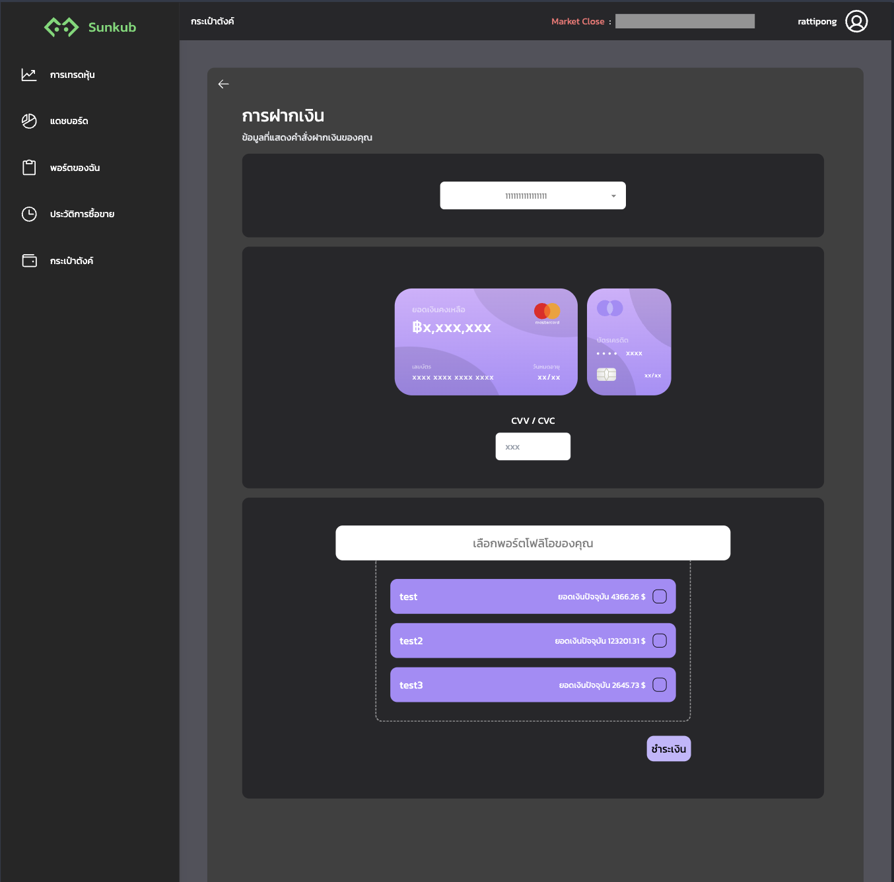

2. การเพิ่มบัตรเครดิตใหม่ 
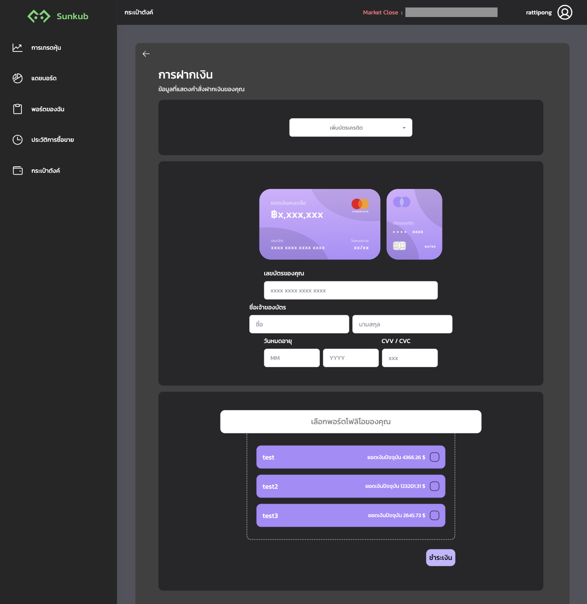

3. การเลือกเติมเงินในแต่ละพอร์ต
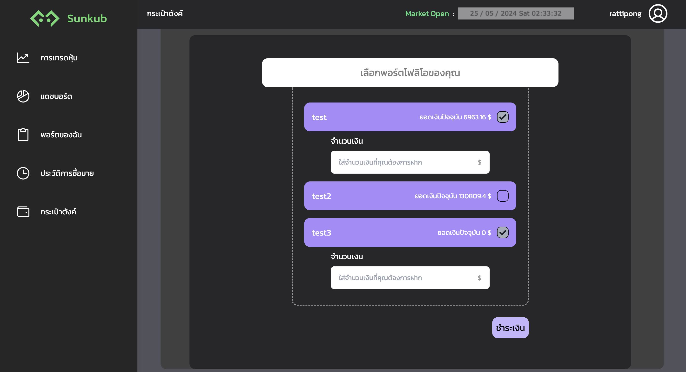

ในการเติมเงิน จะทำการเพิ่มยอดเงินในตาราง ports และเก็บข้อมูลการเติมเงินลงในตาราง deposit_details และตาราง payment_details

โดยตาราง deposit_details จะเก็บไอดีที่ทำการเติม, ยอดรวมทั้งหมด,วิธีชำระเงินและเวลาที่ทำการเติมเงิน

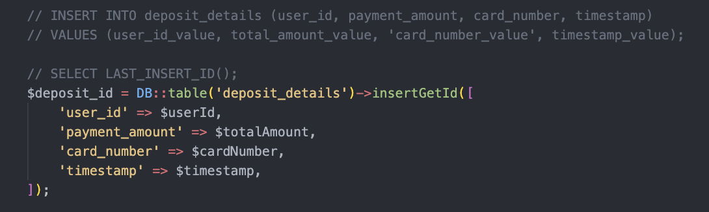

และตาราง payment_details จะเก็บข้อมูลว่าการเติมเงินแต่ละครั้งนั้นเติมเข้าไปที่ portไหนและเติมไปเท่าไหร่บ้าง

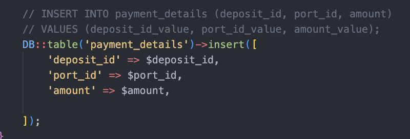

การเติมเงินนั้นสามารถเลือกเพิ่มวิธีการชำระเงินใหม่ได้ด้วยซึ่งหากเลือกเพิ่มวิธีการชำระเงินใหม่เข้าไปก็จะเป็นการเพิ่มข้อมูลบัตรเดบิตใหม่ในตาราง paymentmethods

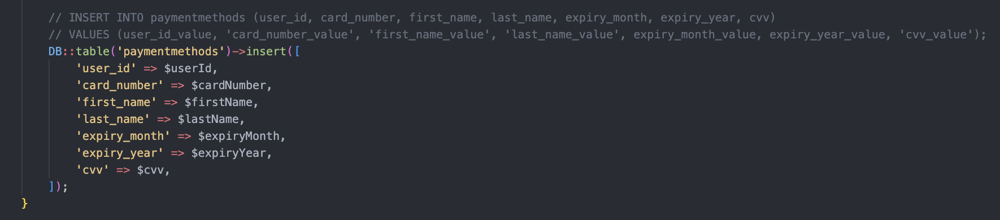
---

## 4. การเพิ่ม broker
- **Role ที่สามารถใช้งานได้**: Administrator  
- **ตารางที่มีการเปลี่ยนแปลงข้อมูล**: `brokers`, `stocks` (optional), `sectors` (optional), `view_stocks`

ในการเพิ่ม broker จะเริ่มจากการกรอกข้อมูลของ broker และทำการเลือกหุ้นที่ broker ให้บริการเทรดได้ ในการเลือกหุ้นสามารถทำได้สองแบบ คือ เลือกหุ้นที่มีอยู่ในระบบ และการเพิ่มหุ้นใหม่

- การเลือกหุ้นที่มีอยู่ในระบบ
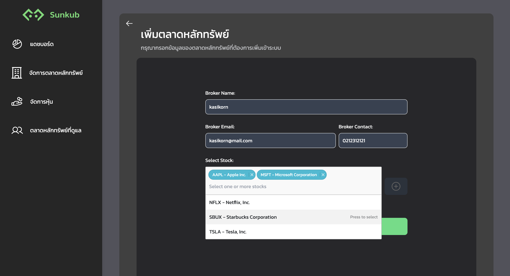

- การเพิ่มหุ้นใหม่
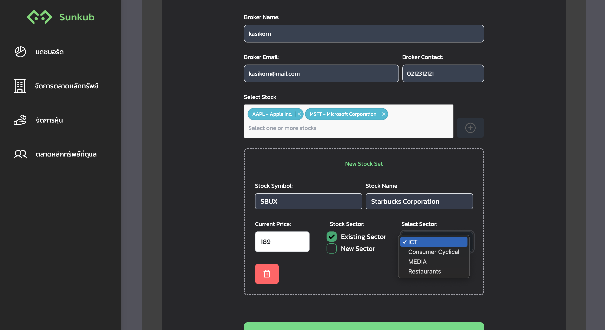

ในส่วนของ `sector` สามารถเลือกได้ว่าใช้ `sector` ที่มีอยู่ในระบบ หรือเพิ่ม `sector` ใหม่
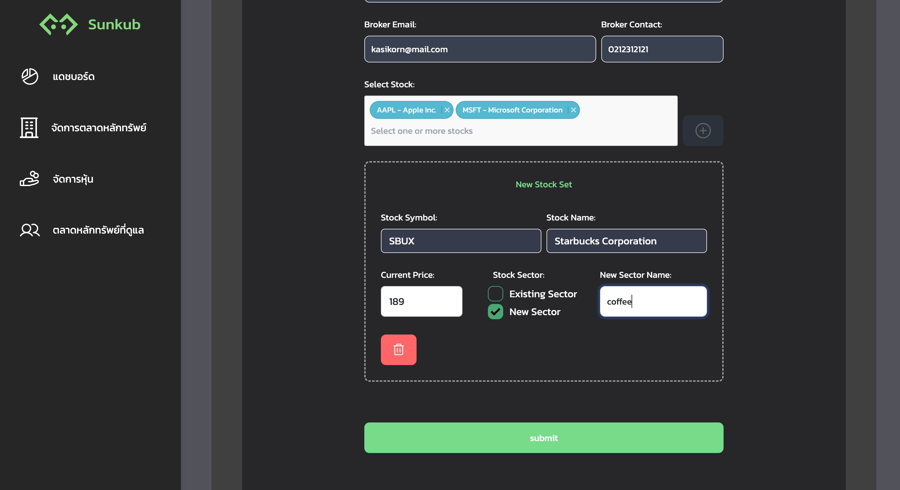

ข้อมูลจะถูกเพิ่มเข้าไปสูงสุด 4 ตาราง คือ `brokers`, `stocks` (optional), `sectors` (optional), `view_stocks`

1. ตาราง `brokers` จะทำการเพิ่มรายละเอียดตามที่ผู้ใช้ได้กรอกเข้ามา จากนั้นจะมีการเช็คว่าผู้ใช้ได้ทำการเพิ่มหุ้นใหม่ที่ไม่เคยมีในระบบหรือไม่
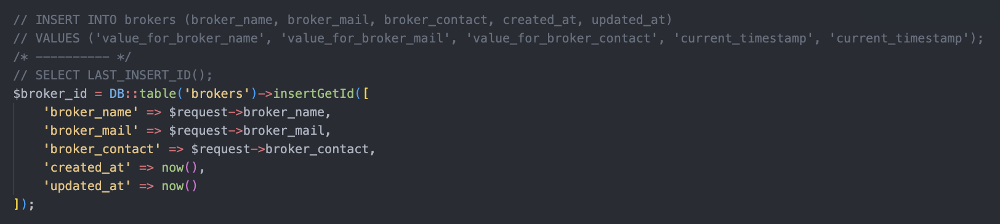
2. หากมีการเพิ่มหุ้นใหม่ ระบบจะทำการเช็คก่อนว่า `sector` ของหุ้นใช้ `sector` เดิมหรือ `sector` ใหม่ หากใช้ `sector` ใหม่จะทำการเพิ่ม `sector` เข้าฐานข้อมูลก่อน และเก็บไอดีที่เพิ่มไว้
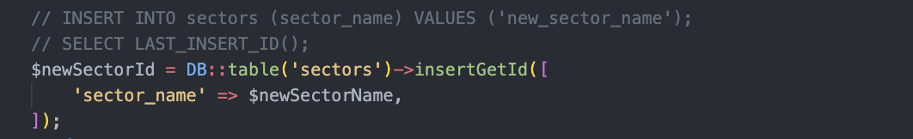
3. จากนั้นก็จะมาเพิ่มหุ้นใหม่เข้าไปตาราง `stocks` โดยใช้ข้อมูลที่ผู้ใช้กรอก และ `sector_id` ที่เลือกจากระบบ หรือที่พึ่งทำการเพิ่มเข้ามาใหม่
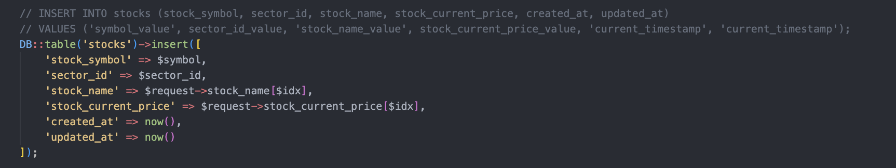
4. สุดท้ายคือการเพิ่มความสัมพันธ์ระหว่าง `broker` ที่สามารถให้บริการเทรดหุ้นตามที่ได้เลือกหรือมีการได้เพิ่มไว้
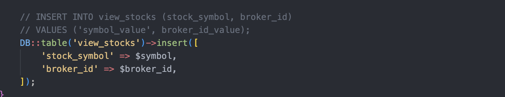

---

## 5. การเพิ่ม stock
- **Role ที่สามารถใช้งานได้**: Administrator  
- **ตารางที่มีการเปลี่ยนแปลงข้อมูล**: `stocks`, `sectors`

การเพิ่ม `stock` จะเป็นการกรอกข้อมูลรายละเอียดหุ้นทั้ง `symbol`, ชื่อบริษัท, ราคาปัจจุบัน (สำหรับราคาของหุ้นจะมีการดึงจาก API ในทุก ๆ 5 นาที ซึ่งทำให้ราคาปัจจุบันจะเปลี่ยนไปในทุก 5 นาที) และ `sector` โดย `sector` จะสามารถเลือกจากที่มีอยู่ในระบบ หรือเพิ่ม `sector` ขึ้นมาใหม่ก็ได้
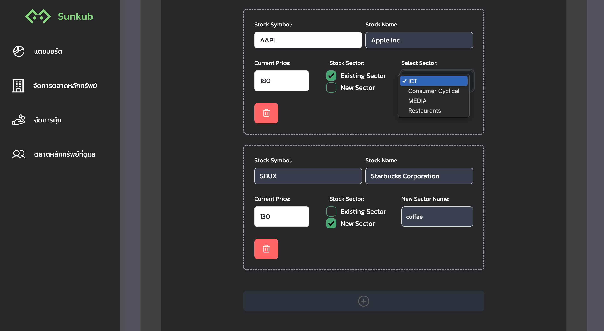

โดยการเพิ่มข้อมูลจะเริ่มการตรวจสอบว่าข้อมูลที่จะทำการเพิ่ม มีการเพิ่ม `sector` ใหม่หรือไม่ หากมีจะทำการเช็คว่า `sector` ที่จะเพิ่มเคยมีในระบบหรือไม่ จึงจะค่อยเพิ่ม `sector` ใหม่
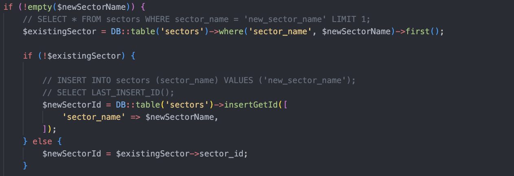

จากนั้นจะทำการเพิ่มข้อมูลหุ้น โดยเพิ่ม `symbol`, ชื่อบริษัท, ราคาปัจจุบัน และ `sector_id` ทั้งที่เลือกจากระบบ และ `sector` ที่เพิ่มขึ้นมาใหม่
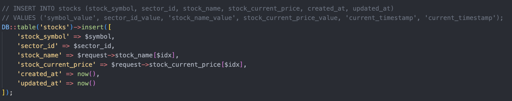
---

# Advanced Analysis Report

### 1. User Dashboard (เงินลงทุนซื้อหุ้นทั้งหมด)
- **Role ที่สามารถใช้งานได้**: Trader  
- **ตารางที่มีการดึงข้อมูล**: `buys`, `stock_prices`, `ports`, `(Brokers, Stocks)`

ในหน้านี้จะเป็นการแสดงผลจำนวนเงินที่ใช้ในการลงทุน ทั้งจำนวนเงินรวม จำนวนเงินที่ใช้ในแต่ละหุ้น ภาพรวมของกำไรภายในพอร์ต และจำนวนเงินที่รวมของทุกพอร์ตที่อยู่ในบัญชีเดียวกัน
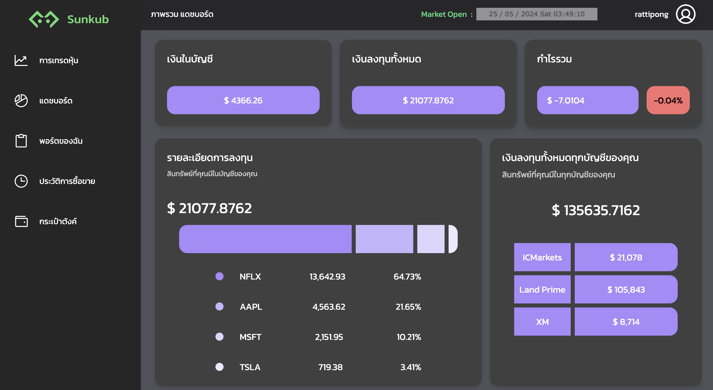

ในส่วนของเงินลงทุนทั้งหมดทุกบัญชีจะทำการรวม 3 ตารางเข้าด้วยกันคือ `buys`, `stock_prices` และ `ports` โดยทำการรวมจำนวนเงินที่ใช้ในการซื้อหุ้นโดยคิดจาก ผลรวมของ `volume` คูณกับราคา ณ ตอนซื้อ
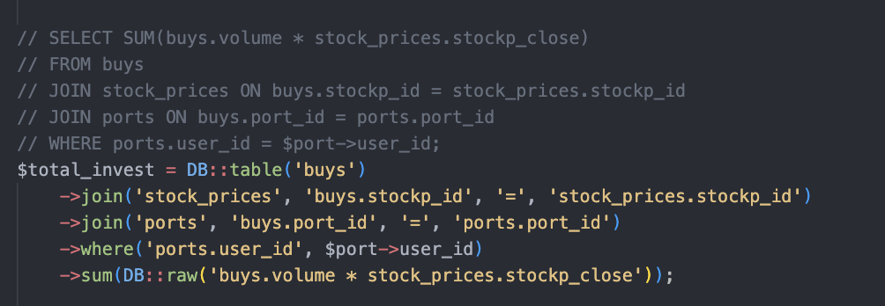

ในการหาเงินลงทุนแต่ละพอร์ต จะใช้วิธีในทำนองเดียวกันแต่จะมีการเพิ่มตาราง `Brokers` เข้ามาเพื่อนำมา `Group By` แยกตาม broker ในแต่ละพอร์ต
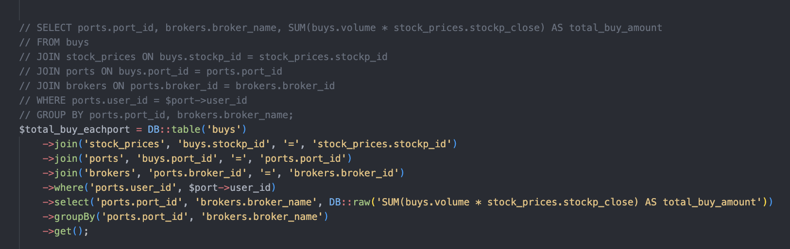

และในส่วนการแสดงเงินลงทุนแยกตามหุ้น ก็จะมีการรวมตาราง `stocks` เข้าไปเพื่อที่จะนำมา `Group By` แยกตามหุ้นที่ได้มีการซื้อไว้ภายในพอร์ต
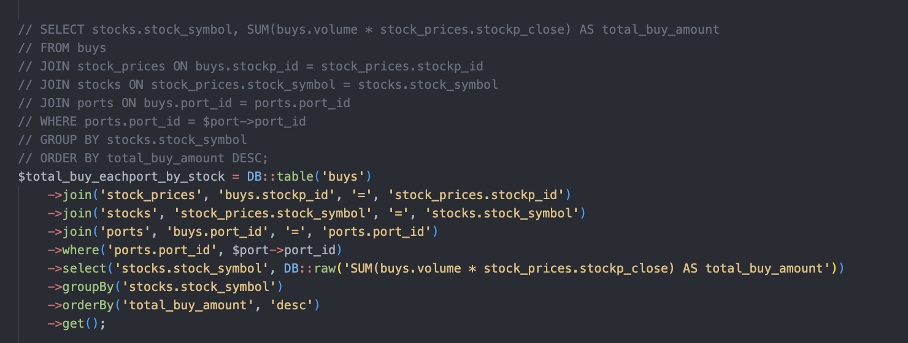
---

### 2. User Portfolio (จำนวนหุ้นที่ถือในแต่ละพอร์ต)
- **Role ที่สามารถใช้งานได้**: Trader  
- **ตารางที่มีการดึงข้อมูล**: `(Buys, Sells)`, `(ports, stock_prices)`, `brokers`, `stocks`

สำหรับหน้านี้จะเป็นการแสดงข้อมูลหุ้นที่มีอยู่ โดยจะมีการแสดงหุ้นรวมทุกพอร์ต แสดงหุ้นรวมแยกแต่ละพอร์ต และแสดงรายการหุ้นที่อยู่ภายในพอร์ต
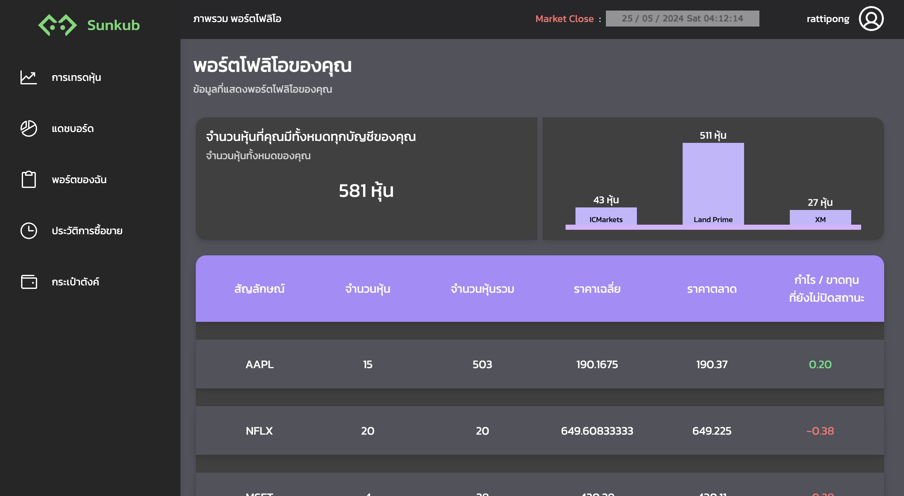

ในการแสดงจำนวนหุ้นรวมโดยแยกแต่ละพอร์ตจะมีการดึงข้อมูลจากสองตาราง คือ ตาราง `buys` และ `sells` โดยทั้งสองตารางจะมีการรวมตาราง `ports` และ `brokers` เข้าไปเพื่อที่จะนำมา `Group By` เพื่อหาผลรวมของ `volume` แยกในแต่ละ `broker` และเมื่อนำผลรวมของ `volume` จากตารางซื้อและขายมาลบกัน จะได้เป็น `volume` คงเหลือของแต่ละพอร์ต

และในการหาจำนวน `volume` คงเหลือของแต่ละหุ้นที่อยู่ภายในพอร์ตจะทำในลักษณะเดียวกัน แต่จะมีการรวมตาราง `stocks` เข้าไปเพื่อนำมา `Group By` ผลรวมแยกตามหุ้น

---

### 3. Admin Dashboard: Buy (หุ้นที่ถูกซื้อมากที่สุด)
- **Role ที่สามารถใช้งานได้**: Administrator  
- **ตารางที่มีการดึงข้อมูล**: `buys`, `stock_prices`, `ports`, `brokers`, `view_admins`

สำหรับหน้านี้จะเป็นการแสดงผลหุ้นที่มีจำนวนการซื้อตาม `volume` มากที่สุด 3 อันดับแรกโดยแยกตามแต่ละ `broker` ซึ่งจะแสดงแค่ `broker` ที่แอดมินคนนี้ดูแลอยู่เท่านั้น

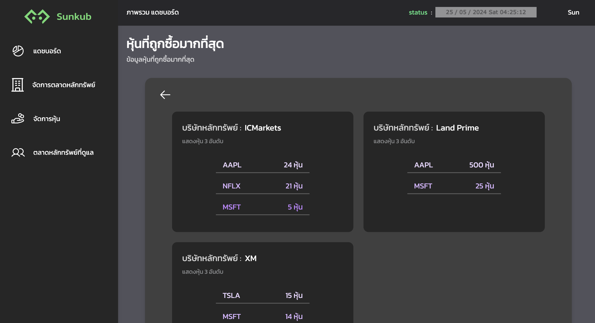

ในการแสดงผลข้อมูลจะมีการดึงข้อมูลมาจากตาราง `buys`, `stock_prices`, `ports`,`brokers` และ `view_admins` โดยเป็นการหาผลรวมของ volume ในแต่ละ `broker` และหุ้นโดยที่จะต้องอยู่ในเงื่อนไขที่ว่า `broker` จะต้องเป็น broker ที่แอดมินคนนี้ดูแลซึ่งสามารถดูได้จากตาราง `view_admins`
>
ในส่วนของ broker ที่แอดมินคนนี้ดูแลอยู่จะมีการเพิ่ม `join` จากตาราง `view_admins` เพื่อทำการกรอง `broker` ให้แสดงเฉพาะที่แอดมินคนนี้ดูแลอยู่เท่านั้น
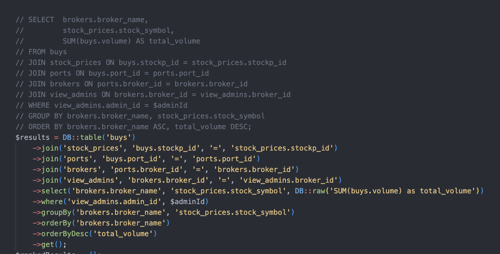
---

### 4. Admin Dashboard: Sell (หุ้นที่ถูกขายมากที่สุด)
- **Role ที่สามารถใช้งานได้**: Administrator  
- **ตารางที่มีการดึงข้อมูล**: `sells`, `stock_prices`, `ports`, `brokers`, `view_admins`

สำหรับหน้านี้จะเป็นการแสดงผลหุ้นที่มีจำนวนการขายตาม `volume` มากที่สุด 3 อันดับแรกโดยแยกตามแต่ละ `broker` ซึ่งจะแสดงแค่ `broker` ที่แอดมินคนนี้ดูแลอยู่เท่านั้น
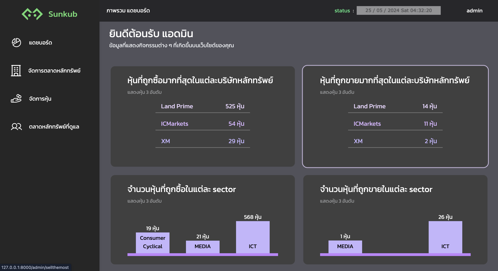
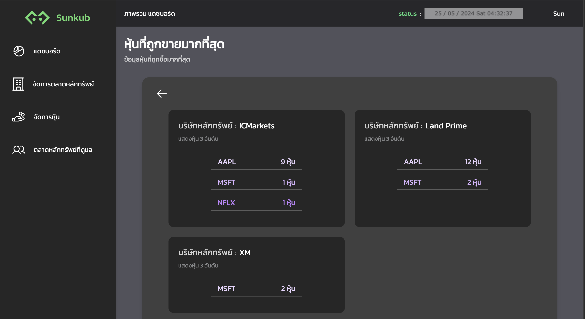

ในการแสดงผลข้อมูลจะมีการดึงข้อมูลมาจากตาราง `sells`, `stock_prices` และ `ports` เพื่อทำการ `Join` ข้อมูลในแต่ละตารางเข้าด้วยกัน จากนั้นจะทำการ `Group By` ข้อมูลโดยแยกตาม `broker` และนำมาคำนวนผลรวมของ `volume` ที่ขายไปมากที่สุด 3 อันดับแรกโดยแยกในแต่ละ `broker`
ในส่วนของ broker ที่แอดมินคนนี้ดูแลอยู่จะมีการเพิ่ม `join` จากตาราง `view_admins` เพื่อทำการกรอง `broker` ให้แสดงเฉพาะที่แอดมินคนนี้ดูแลอยู่เท่านั้น
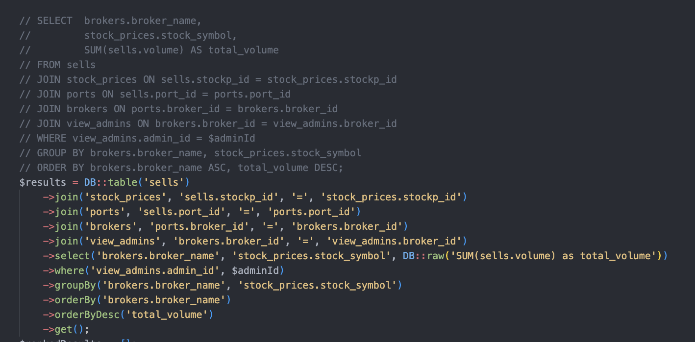

---

### 5.  Admin Dashboard : Buy each Sector (หุ้นที่ถูกซื้อมากที่สุดในแต่ละ sector)
- **Role ที่สามารถใช้งานได้** : Administrator
- **ตารางที่มีการดึงข้อมูล** : `buys`, `stock_prices`, `stocks`, `sectors`, `ports`,
    `brokers`, `view_admins`

ในส่วนนี้จะเป็นการแสดงจำนวนหุ้นที่มีจำนวน volume ที่ถูกซื้อในแต่ละ sector มากที่สุด 3 อันดับ โดยแยกตามแต่ละ broker ซึ่ง broker ที่แสดงจะต้องเป็น broker ที่ admin คนนี้ดูแลอยู่เท่านั้น
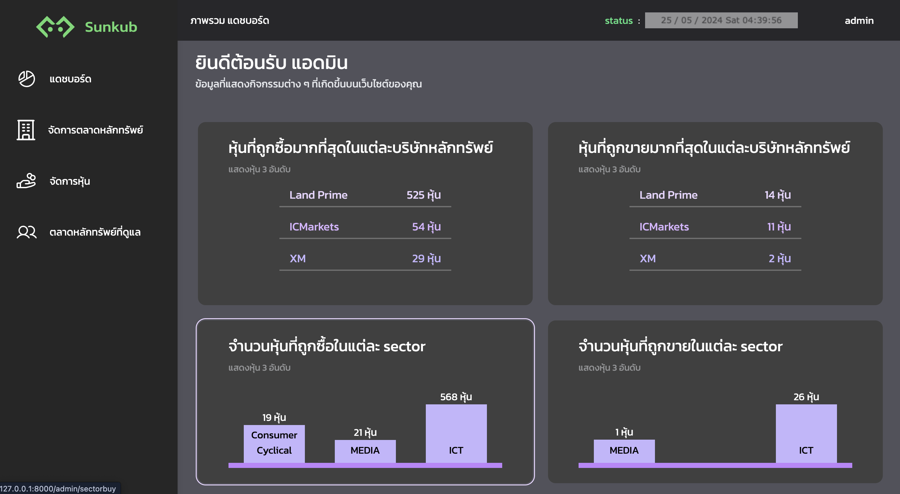
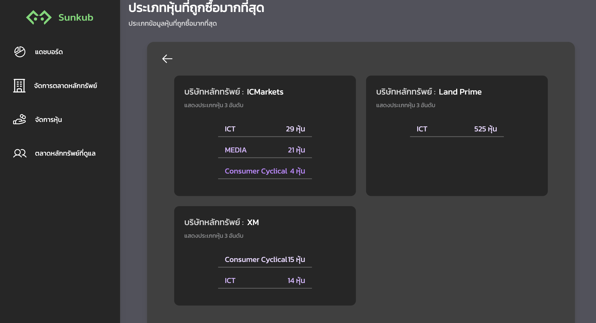

ซึ่งในการดึงข้อมูลมาแสดงผลจะทำได้โดยการดึงข้อมูลจากตาราง `buys`, `stock_prices`, `stocks`, `sectors`, `ports`, `brokers` และ `view_admins` โดยเป็นการหาผลรวม volume ของหุ้น ที่ Group By ตาม `broker_name` และ `sector_name` ซึ่งจะดึงข้อมูลมาแค่ broker ที่ admin คนนี้ดูแล
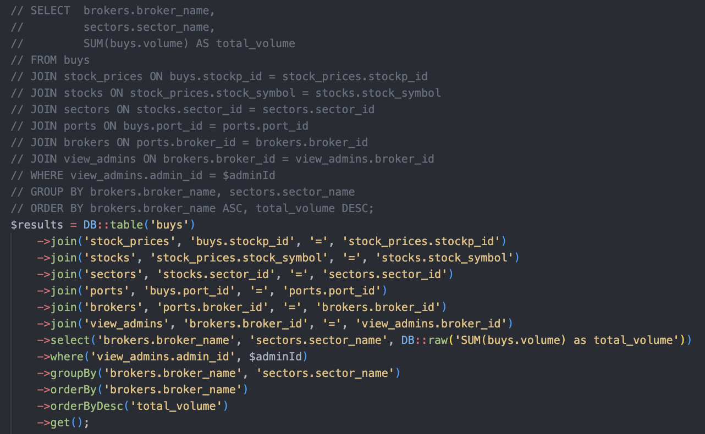

---

### 6.  Admin Dashboard : Sell each Sector (หุ้นที่ถูกขายมากที่สุดในแต่ละ sector)
- **Role ที่สามารถใช้งานได้** : Administrator
- **ตารางที่มีการดึงข้อมูล** : `sells`, `stock_prices`, `stocks`, `sectors`, `ports`, `brokers`, `view_admins`

สำหรับหน้านี้จะเป็นการแสดงจำนวนหุ้นที่มีจำนวน volume ที่ถูกขายมากที่สุด 3 อันดับในแต่ละ sector โดยแยกตามแต่ละ broker ซึ่ง broker ที่แสดงจะต้องเป็น broker ที่ admin คนนี้ดูแลอยู่เท่านั้น

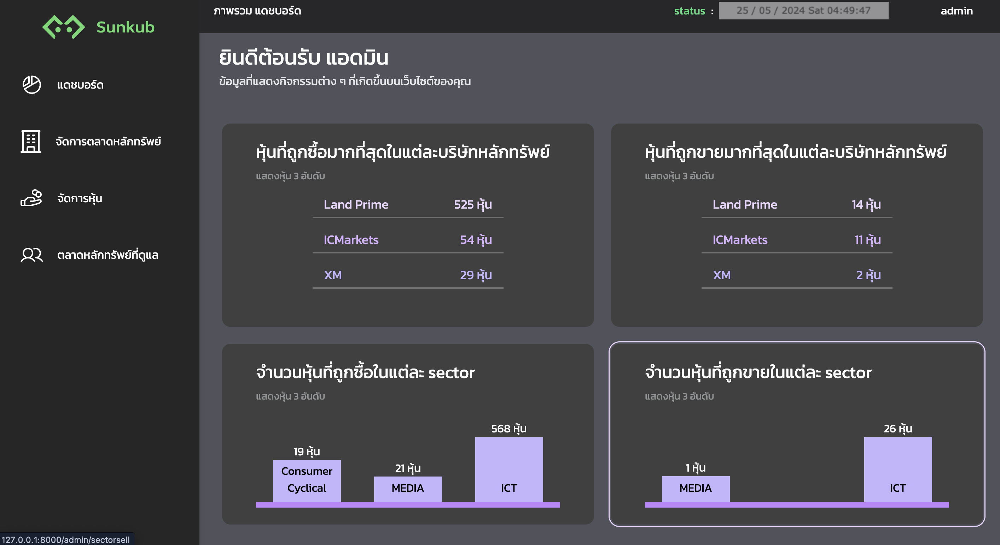
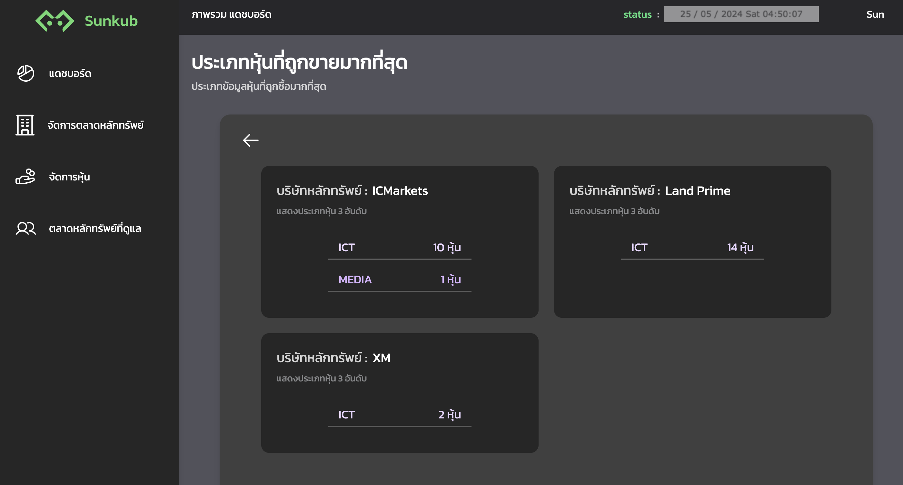

สำหรับวิธีการการดึงข้อมูลมาแสดงผลจะทำได้โดยการดึงข้อมูลจากตาราง sells, stock_prices, stocks, sectors, ports, brokers และ view_admins โดยเป็นการหาผลรวม volume ของหุ้นที่ขาย โดย Group By ตาม broker_name และ sector_name ตามลำดับ ซึ่งการดึงข้อมูลจะดึงข้อมูลมาแค่ broker ที่ admin คนนี้ดูแล

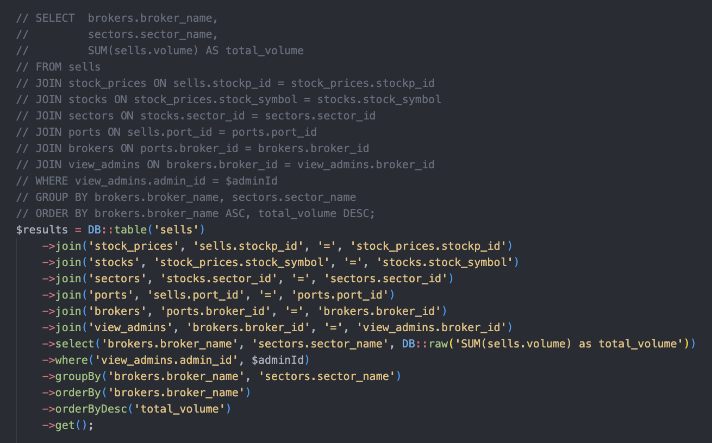

---

# Data Dictionary

## 1. Table: users

| **Attribute** | **Datatype** | **Length** | **Constraint** | **Definition**                              |
|---------------|--------------|------------|----------------|---------------------------------------------|
| account_id    | bigint       | 20         | Primary key    | เลขรหัสประจำตัวของ user แต่ละคน (สร้างอัตโนมัติ) |
| fname         | varchar      | 191        | NOT NULL       | ชื่อจริงของ user                           |
| lname         | varchar      | 191        | NOT NULL       | นามสกุลของ user                            |
| gender        | enum         | -          | -              | เพศของ user                                |
| dob           | date         | -          | NOT NULL       | วันเกิดของ user                            |
| email         | varchar      | 191        | NOT NULL       | email สำหรับติดต่อ user                    |
| tel           | varchar      | 191        | NOT NULL       | เบอร์โทรสำหรับติดต่อ user                 |
| password      | varchar      | 191        | NOT NULL       | password ของ user                           |
| created_at    | timestamp    | -          | -              | เวลาที่ user ถูกสร้าง (เวลาที่ลงทะเบียนเสร็จสิ้น) |
| updated_at    | timestamp    | -          | -              | เวลาที่มีการ update ข้อมูลของ user ครั้งล่าสุด |

## 2. Table: ports

| **Attribute** | **Datatype** | **Length** | **Constraint** | **Definition**                              |
|---------------|--------------|------------|----------------|---------------------------------------------|
| port_id       | bigint       | 20         | Primary key    | เลขรหัสประจำตัวของ port แต่ละ port (สร้างอัตโนมัติ) |
| user_id       | bigint       | 20         | Foreign key    | id ของ user ที่เป็นเจ้าของ port            |
| broker_id     | bigint       | 20         | Foreign key    | id ของ broker ที่ดูแล port                  |
| user_broker   | varchar      | 191        | NOT NULL       | username ของ port ที่ไปเปิดกับทาง broker    |
| password      | varchar      | 191        | NOT NULL       | password ของ port                           |
| balance       | double       | 15,4       | NOT NULL       | ยอดเงินคงเหลือภายใน port                   |
| created_at    | timestamp    | -          | -              | เวลาที่ port ถูกสร้าง                       |
| updated_at    | timestamp    | -          | -              | เวลาที่มีการ update ข้อมูลของ port ครั้งล่าสุด |

## 3. Table: buys

| **Attribute** | **Datatype** | **Length** | **Constraint** | **Definition**                              |
|---------------|--------------|------------|----------------|---------------------------------------------|
| buy_id        | bigint       | 20         | Primary key    | รหัสคำสั่งซื้อ (สร้างอัตโนมัติ)           |
| port_id       | bigint       | 20         | Foreign key    | id ของ port ที่เป็นเจ้าของคำสั่งซื้อ       |
| stockp_id     | bigint       | 20         | Foreign key    | id ของ ข้อมูลราคาหุ้น ณ ขณะที่ทำการซื้อ     |
| volume        | double       | 15,4       | NOT NULL       | จำนวนหุ้นที่ซื้อ (หน่วยเป็น unit)          |
| created_at    | timestamp    | -          | -              | เวลาที่ทำการซื้อสำเร็จ                      |
| updated_at    | timestamp    | -          | -              | เวลาที่มีการ update ข้อมูลของคำสั่งซื้อครั้งล่าสุด |

## 4. Table: sells

| **Attribute** | **Datatype** | **Length** | **Constraint** | **Definition**                              |
|---------------|--------------|------------|----------------|---------------------------------------------|
| sell_id       | bigint       | 20         | Primary key    | รหัสคำสั่งขาย (สร้างอัตโนมัติ)            |
| port_id       | bigint       | 20         | Foreign key    | id ของ port ที่เป็นเจ้าของคำสั่งขาย        |
| stockp_id     | bigint       | 20         | Foreign key    | id ของ ข้อมูลราคาหุ้น ณ ขณะที่ทำการขาย     |
| volume        | double       | 15,4       | NOT NULL       | จำนวนหุ้นที่ขาย (หน่วยเป็น unit)          |
| created_at    | timestamp    | -          | -              | เวลาที่ดำเนินการขายสำเร็จ                  |
| updated_at    | timestamp    | -          | -              | เวลาที่มีการ update ข้อมูลของการขาย         |

## 5. Table: stocks

| **Attribute** | **Datatype** | **Length** | **Constraint** | **Definition**                              |
|---------------|--------------|------------|----------------|---------------------------------------------|
| stock_symbol  | varchar      | 10         | Primary key    | ชื่อของตัวหุ้น เช่น AAPL (Apple) หรือ MSFT (Microsoft) |
| sector_id     | bigint       | 20         | Foreign key    | รหัส Sector ของหุ้น                        |
| stock_name    | varchar      | 191        | NOT NULL       | ชื่อบริษัทที่เป็นเจ้าของหุ้น               |
| stock_current_price | double  | -          | NOT NULL       | ราคาหุ้น ณ ปัจจุบัน                        |
| created_at    | timestamp    | -          | -              | เวลาที่สร้างข้อมูลหุ้น                     |
| updated_at    | timestamp    | -          | -              | เวลาล่าสุดที่มีการ update ข้อมูลของหุ้น     |

## 6. Table: stock_prices

| **Attribute** | **Datatype** | **Length** | **Constraint** | **Definition**                              |
|---------------|--------------|------------|----------------|---------------------------------------------|
| stockp_id     | bigint       | 20         | Primary key    | รหัสของชุดข้อมูลราคาหุ้น (สร้างอัตโนมัติ)  |
| stock_symbol  | varchar      | 10         | Foreign key    | ชื่อของตัวหุ้น                            |
| stockp_close  | double       | 15,4       | NOT NULL       | ราคาหุ้น ณ เวลาที่ปิดราคา                  |
| created_at    | timestamp    | -          | -              | เวลาที่มีการ update ราคาใหม่                |
| updated_at    | timestamp    | -          | -              | เวลาล่าสุดที่มีการ update ราคาหุ้นของแต่ละ record |

## 7. Table: sectors

| **Attribute** | **Datatype** | **Length** | **Constraint** | **Definition**                              |
|---------------|--------------|------------|----------------|---------------------------------------------|
| sector_id     | bigint       | 20         | NOT NULL       | รหัสของ sector (สร้างอัตโนมัติ)           |
| sector_name   | varchar      | 191        | NOT NULL       | ชื่อของ sector                             |

## 8. Table: brokers

| **Attribute** | **Datatype** | **Length** | **Constraint** | **Definition**                              |
|---------------|--------------|------------|----------------|---------------------------------------------|
| broker_id     | bigint       | 20         | Primary key    | รหัสของ broker (สร้างอัตโนมัติ)           |
| broker_name   | varchar      | 191        | NOT NULL       | ชื่อของ broker                             |
| mailcontact   | varchar      | 191        | NOT NULL       | อีเมลสำหรับติดต่อ broker                   |
| create_at     | timestamp    | -          | -              | เวลาในการสร้างบัญชี                        |
| updated_at    | timestamp    | -          | -              | เวลาการอัปเดทบัญชี                        |

## 9. Table: admins

| **Attribute** | **Datatype** | **Length** | **Constraint** | **Definition**                              |
|---------------|--------------|------------|----------------|---------------------------------------------|
| admin_id      | bigint       | 20         | Primary key    | รหัสของแอดมิน (สร้างอัตโนมัติ)            |
| email         | varchar      | 191        | Foreign key    | อีเมลของแอดมิน                             |
| fname         | varchar      | 191        | NOT NULL       | ชื่อจริงของแอดมิน                          |
| lname         | varchar      | 191        | NOT NULL       | นามสกุลของแอดมิน                          |
| gender        | enum         | -          | -              | เพศของแอดมิน                               |
| dob           | date         | -          | NOT NULL       | วัน/เดือน/ปี เกิด                          |
| tel           | varchar      | 191        | NOT NULL       | เบอร์โทรศัพท์                             |
| password      | varchar      | 191        | NOT NULL       | รหัสเข้าสู่ระบบ                             |
| create_at     | timestamp    | -          | -              | เวลาในการสร้างบัญชี                        |
| updated_at    | timestamp    | -          | -              | เวลาการอัปเดทบัญชี                        |

## 10. Table: view_admins

| **Attribute** | **Datatype** | **Length** | **Constraint** | **Definition**                              |
|---------------|--------------|------------|----------------|---------------------------------------------|
| broker_id     | bigint       | 20         | Primary key    | รหัสของ broker (สร้างอัตโนมัติ)           |
| admin_id      | bigint       | 20         | Primary key    | รหัสของผู้ดูแลระบบ                         |

## 11. Table: view_stocks

| **Attribute** | **Datatype** | **Length** | **Constraint** | **Definition**                              |
|---------------|--------------|------------|----------------|---------------------------------------------|
| stock_id      | bigint       | 20         | Primary key    | รหัสของหุ้น (สร้างอัตโนมัติ)              |
| sector_id     | bigint       | 20         | Foreign key    | รหัสของ sector                             |
| stock_name    | varchar      | 191        | NOT NULL       | ชื่อของหุ้น                                |
| stock_price   | double       | 15,4       | NOT NULL       | ราคาหุ้น ณ ขณะนั้น                         |

## 12. Table: deposit_details

| **Attribute**  | **Datatype** | **Length** | **Constraint** | **Definition**                              |
|----------------|--------------|------------|----------------|---------------------------------------------|
| deposit_id     | bigint       | 20         | Primary key    | รหัสของ transaction การฝากเงิน (สร้างอัตโนมัติ) |
| user_id        | bigint       | 20         | Foreign key, NOT NULL | รหัสของ user ที่เป็นเจ้าของ transaction    |
| payment_amount | double       | 15,4       | NOT NULL       | ยอดเงินทั้งหมดที่จะฝากเข้าไปใน 1 transaction |
| card_number    | varchar      | 191        | NOT NULL       | เลขบัตรที่จะใช้ในการชำระเงิน              |
| create_at      | timestamp    | -          | -              | เวลาในการฝากเงิน                          |
| updated_at     | timestamp    | -          | -              | เวลาการอัปเดทข้อมูลการฝากเงิน             |

## 13. Table: payment_details

| **Attribute**  | **Datatype** | **Length** | **Constraint** | **Definition**                              |
|----------------|--------------|------------|----------------|---------------------------------------------|
| pay_id         | bigint       | 20         | Primary key    | รหัสของรายละเอียดการฝากเงิน (สร้างอัตโนมัติ) |
| deposit_id     | bigint       | 20         | Foreign key, NOT NULL | รหัสของคำสั่งการฝากเงิน                   |
| port_id        | bigint       | 20         | Foreign key, NOT NULL | รหัสของ port ที่จะฝากเงินเข้าไป            |
| amount         | double       | 15,4       | NOT NULL       | จำนวนเงินที่จะฝากเข้าไปใน port             |

## 14. Table: paymentmethods

| **Attribute**  | **Datatype** | **Length** | **Constraint** | **Definition**                              |
|----------------|--------------|------------|----------------|---------------------------------------------|
| pay_id         | bigint       | 20         | Primary key    | รหัสของรายละเอียดการฝากเงิน               |
| deposit_id     | bigint       | 20         | Foreign key, NOT NULL | รหัสของคำสั่งการฝากเงิน                   |
| port_id        | bigint       | 20         | Foreign key, NOT NULL | รหัสของ port ที่จะฝากเงินเข้าไป            |
| amount         | double       | 15,4       | NOT NULL       | จำนวนเงินที่จะฝากเข้าไปใน port             |
