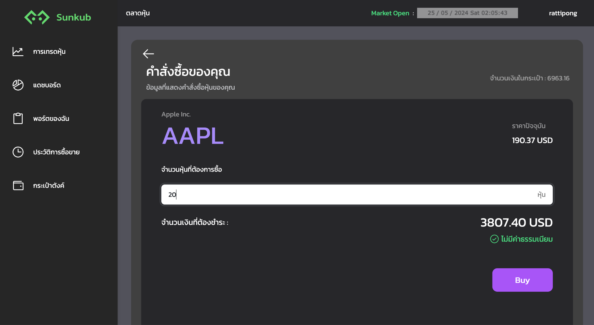
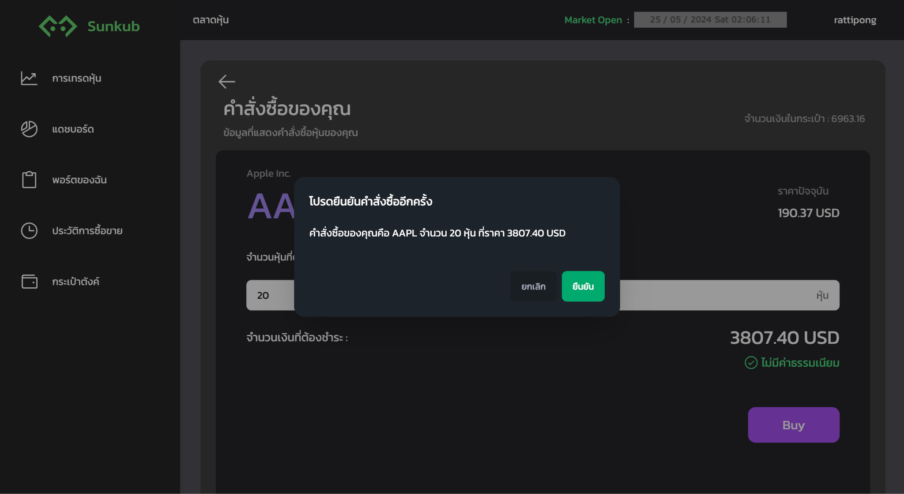
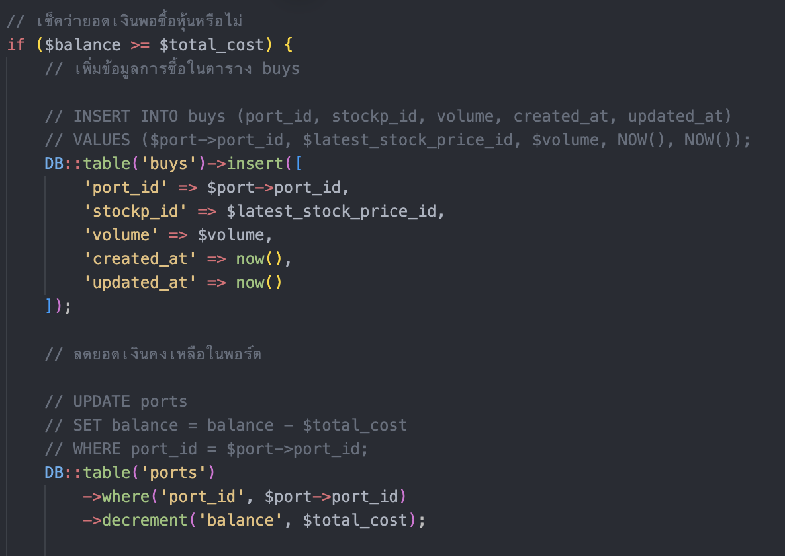
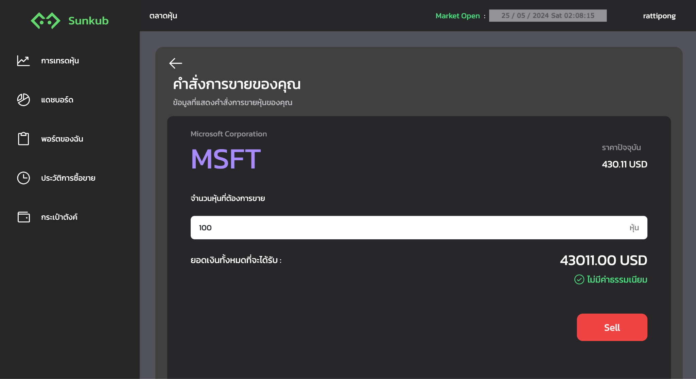
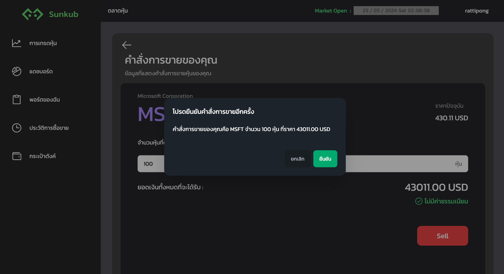
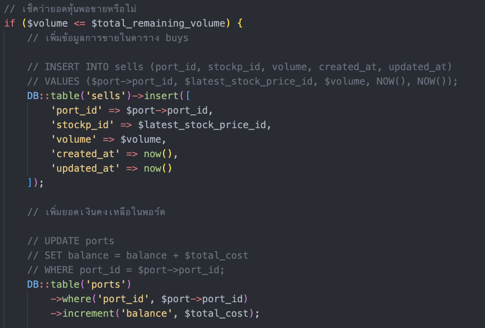
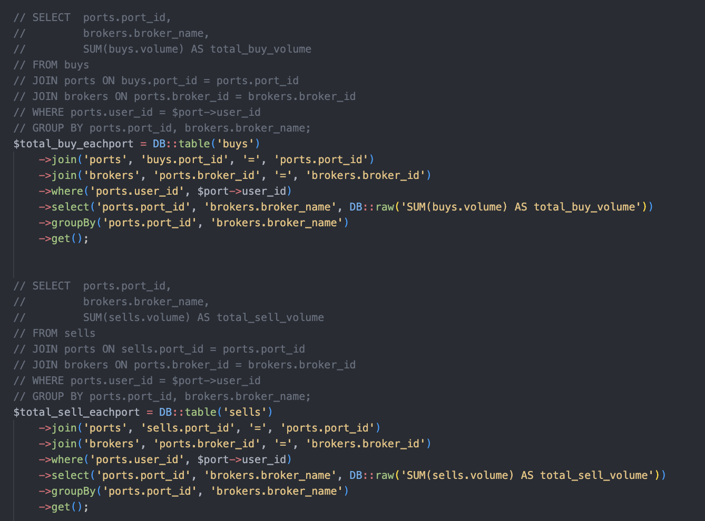
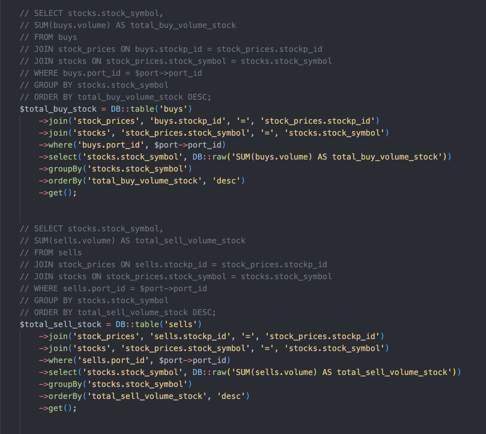

{width="1.671875546806649in"
height="1.671875546806649in"} []{.mark}

**\
**CPE 241 Database Systems Final Project

Sunkub (stock trading)

จัดทำโดย

> [65070501048 รัฐธิพงษ์ สกุลจีน]{.mark}
>
> [65070501072 ชนกันต์ จิตรกสิกร]{.mark}
>
> [65070501074 ณภัทร สินจินดาวงศ์]{.mark}
>
> [65070501075 ณัฐชนน บุญยะโท]{.mark}
>
> [65070501084 ภูมิรพี เมืองน้อย]{.mark}
>
> []{.mark}

เสนอ

[ผศ.ดร.พร พันธุ์จงหาญ]{.mark}

[ผศ.ดร.เอกชัย วิวรรธนาภิรักษ์]{.mark}

[]{.mark}

[รายงานนี้เป็นส่วนหนึ่งของรายวิชา]{.mark} Database Systems [(CPE 241)]{.mark}

[คณะวิศวกรรมศาสตร์ ภาควิชาวิศวกรรมคอมพิวเตอร์]{.mark}

[มหาวิทยาลัยเทคโนโลยีพระจอมเกล้าธนบุรี\
ภาคเรียนที่ 2 ปีการศึกษา 2566]{.mark}

**หัวข้อที่เลือก**

หัวข้อที่กลุ่มของเราเลือกในการออกแบบฐานข้อมูลของโปรเจกต์นี้ คือ การออกแบบระบบฐานข้อมูล

ของการซื้อ-ขายหุ้น (Stock Trading)
เนื่องจากทางกลุ่มของเรามีความสนใจในระบบการซื้อ-ขายหุ้น
ซึ่งระบบที่กลุ่มของเราได้พัฒนาขึ้นจะประกอบด้วยฟังก์ชันต่าง ๆ
เพื่ออำนวยความสะดวกในการตัดสินใจ

ดำเนินการซื้อ-ขายหุ้น เช่น Dashboard ที่จะสรุปข้อมูลการลงทุนของผู้ลงทุน (Trader) หรือ
Portfolio ที่จะสรุปรายละเอียดของหุ้นแต่ละตัวที่อยู่ในการครอบครอง เป็นต้น

**รายละเอียดและขอบเขตในการทำงาน**

Sunkub เป็นเว็บไซต์ที่ใช้ในการซื้อ-ขายหุ้นต่าง ๆ โดยกลุ่มของเราจะออกแบบฐานข้อมูลสำหรับ\
ระบบการซื้อ-ขายหุ้น ซึ่งจะประกอบด้วยระบบย่อยต่าง ๆ ดังนี้

1.  ระบบสมาชิกของผู้ใช้งาน : เป็นการสมัครสมาชิกเพื่อเข้าใช้เว็บไซต์

2.  ระบบซื้อ-ขายหุ้น :
    เป็นฟังก์ชันที่ใช้ในการเลือกซื้อหรือขายหุ้นที่สนใจโดยสามารถกำหนดจำนวนหุ้น\
    ที่จะซื้อหรือขายได้ตามต้องการ (ในกรณีที่มีหุ้นเพียงพอต่อคำสั่ง)

3.  ระบบเติมเงิน : เป็นระบบที่ใช้ในการเติมเงินเข้าไปในบัญชีเทรดหุ้น (cash balance)
    โดยมี\
    วิธีการเติมเงินคือ การใช้บัตรเครดิต หรือ master card
    ซึ่งผู้ใช้งานสามารถเพิ่มบัตรเครดิต\
    ที่ต้องการใช้ หรือเลือกบัตรที่มีประวัติบันทึกอยู่ในระบบได้
    และสามารถเลือกปริมาณที่ต้องการเติม\
    ในแต่ละบัญชีย่อยของตัวเองได้

4.  ระบบจัดการข้อมูลของบริษัทตลาดหลักทรัพย์ : เป็นระบบสำหรับ admin
    ที่ใช้ในการจัดการข้อมูล หรือการเพิ่มลดบริษัทตลาดหลักทรัพย์

5.  ระบบจัดการข้อมูลของหุ้น : เป็นระบบสำหรับ admin ที่ใช้ในการจัดการข้อมูล
    หรือการเพิ่มลดหุ้น

**Business Rule**

1.  เวลาทำการซื้อขายตามเวลาประเทศไทย วันจันทร์ถึงวันศุกร์ เวลา 21.00 ถึง 4.00 น.

2.  หน่วยการซื้อขายหุ้นเป็นจำนวนหุ้นตั้งแต่ 1 หุ้นขึ้นไป

3.  การซื้อขายเป็นแบบต่อเนื่อง คำสั่งซื้อหรือขายจะดำเนินการทันทีที่ราคาตลาดปัจจุบัน

4.  ค่าเงินทั้งในการซื้อ-ขาย และเติมเงินเป็นหน่วย USD (ดอลลาร์สหรัฐ)

5.  ผู้ใช้ต้องมีบัญชีที่เปิดกับโบรกเกอร์อยู่แล้ว

6.  ผู้ใช้ที่ไม่ได้ลงทะเบียนกับโบรกเกอร์จะไม่สามารถซื้อขายหุ้นได้

7.  ผู้ใช้สามารถซื้อ-ขายหุ้นที่มีในระบบตามที่แต่ละโบรกเกอร์ให้บริการเทรดเท่านั้น

8.  ในการเติมเงินเข้าบัญชีรองรับเพียง debit card

**Major user roles**

1.  Guest : เป็น role เริ่มต้นสำหรับผู้เข้าชมเว็บไซต์ ที่สามารถดูได้แค่หน้า landing
    แต่เมื่อทำการ\
    สมัครสมาชิกของเว็บไซต์แล้ว ก็จะสามารถล็อคอินเข้ามาในหน้า landing
    ที่เป็นส่วนของผู้ที่มีบัญชี รวมถึงสามารถดูกราฟของหุ้นที่สนใจได้
    แต่ยังไม่สามารถทำการซื้อ/ขายหุ้นได้

2.  Trader : เมื่อล็อคอินเข้าบัญชีผู้ใช้เว็บไซต์ และล็อคอินเข้าบัญชีสำหรับเทรดหุ้นแล้ว
    ก็จะเข้ามา\
    ในส่วนของ role Trader ซึ่ง role นี้จะสามารถใช้หรือเข้าชมฟังก์ชันในส่วนของ user
    ได้ทั้งหมด ไม่ว่าจะเป็นหน้าแดชบอร์ด ที่จะสรุปรายละเอียดเงินที่ใช้ซื้อหุ้นของบัญชี
    เงินลงทุนในแต่ละพอร์ต\
    ของบัญชี และกำไรรวมของบัญชี หรือฟังก์ชันซื้อ/ขายหุ้นที่สนใจ แต่จะมีข้อจำกัดด้วยจำนวนหุ้น\
    หรือเงินที่มี ซึ่งการซื้อ/ขายในแต่ละคำสั่งจะถูกบันทึกไว้ที่หน้าประวัติการซื้อขาย
    อีกทั้งยังสามารถ\
    ดูรายละเอียดของหุ้นที่ซื้อ เช่น​ ราคาที่ซื้อ ราคาตลาด
    จำนวนที่ซื้อและกำไร/ขาดทุนที่ยังไม่ปิดสถานะ นอกจากนี้ยังมีฟังก์ชันกระเป๋าตัง
    ที่แสดงจำนวนเงินในบัญชีและสามารถทำการเติมเงินเข้าไปในบัญชี เพื่อใช้ในการซื้อหุ้นได้

3.  Administrator : เป็นผู้ที่ดูแลทั้งในส่วนของผู้เทรดหุ้น (Trader) บริษัทตลาดหลักทรัพย์
    (Broker) และหุ้น (Stock) กล่าวคือสามารถดูภาพรวมของหุ้นที่ถูกซื้อ/ขาย ที่หน้าแดชบอร์ด
    และสามารถ\
    จัดการเพิ่ม/ลด หรือแก้ไขข้อมูลของบริษัทตลาดหลักทรัพย์ และหุ้นได้

**Cross-reference of user views**

V = View (มองเห็นข้อมูล), A = Add (เพิ่มข้อมูล) , D = Delete (ลบข้อมูล), E = Edit
(แก้ไขข้อมูล)

  ----------------- ----------------- ----------------- -----------------
    **Relation**        **Guest**        **Trader**         **Admin**

        users              VA                VA                 V

        ports              \-                VE                 V

        buys               \-                VA                 V

        sells              \-                VA                 V

       stocks              \-                 V                VA

    stock_prices           \-                VA                 V

       sectors             \-                 V                VA

       brokers             \-                 V                VA

       admins              \-                \-                VA

     view_admins           \-                \-                 V

     view_stocks           \-                \-                VA

    DepositDetail          \-                VA                \-

    PaymentDetail          \-                VA                \-

    PaymentMethod          \-                VA                \-
  ----------------- ----------------- ----------------- -----------------

**ER-diagram**{width="6.895293088363955in"
height="5.8125in"}

**Complex Transaction Form**

1.  **การซื้อหุ้น**\
    *Role ที่สามารถใช้งานได้* : Trader

> *ตารางที่มีการเปลี่ยนแปลงข้อมูล* : buys, ports
>
> ในการซื้อหุ้นจะเป็นการส่งคำสั่งชื้อหุ้นที่สนใจ ตามจำนวนหุ้นที่กรอก
> จากนั้นจำนวนหุ้นจะถูกคิดเป็นเงินที่จะใช้ในการซื้อ โดยดึงราคาหุ้นปัจจุบันในตาราง stocks
> มาคำนวณ
>
> {width="6.267716535433071in"
> height="3.4444444444444446in"}
>
> {width="6.267716535433071in"
> height="3.4305555555555554in"}
>
> สำหรับการเพิ่มข้อมูล ข้อมูลการซื้อจะถูกเพิ่มเข้าไปในตาราง buys โดยเพิ่ม port_id,
> stockp_id, volume, created_at และ updated_at อีกทั้งยังมีการเปลี่ยนแปลงค่า
> balance ในตาราง ports โดยการนำ balance เดิมมาลบกับ total_cost ดังรูป

{width="5.623441601049869in"
height="3.9846095800524934in"}

2.  **การขายหุ้น**\
    *Role ที่สามารถใข้งานได้* : Trader\
    *ตารางที่มีการเปลี่ยนแปลงข้อมูล* : sells, ports

> ในการขายหุ้นส่งคำสั่งการขายหุ้น โดยระบบจะทำการเช็คจำนวนหุ้นที่ขาย และจำนวนหุ้นที่มีอยู่
> (คำนวณจากการนำตาราง Buys และ Sells มาลบกันจะได้ volume คงเหลือ)
> และนำจำนวนหุ้นที่ต้องการขายมาคำนวณหาผลตอบแทนจากการขาย
>
> {width="6.267716535433071in"
> height="3.4166666666666665in"}
>
> {width="6.267716535433071in"
> height="3.4166666666666665in"}
>
> สำหรับการเพิ่มข้อมูล ข้อมูลการขายจะถูกเพิ่มเข้าไปในตาราง sells โดยเพิ่มไปที่คอลัมน์
> port_id, stockp_id, volume, created_at และ updated_at
> อีกทั้งยังมีการเปลี่ยนแปลงค่า balance ในตาราง ports โดยการนำ balance
> เดิมมาบวกกับ total_cost ดังรูป
>
> {width="6.267716535433071in" height="4.25in"}

3.  **การเติมเงิน**\
    *Role ที่สามารถใช้งานได้* : Trader\
    *ตารางที่มีการเปลี่ยนแปลงข้อมูล* : ports, deposit_details,
    payment_details,\
    paymentmethods

> การเติมเงินจะถูกแบบเป็นสอบแบบ แบบแรกคือการเลือกบัตรเครดิตที่มีอยู่ และแบบที่สอง
>
> คือการเพิ่มบัตรเครดิตใหม่ และในการเติมเงินในทั้งสองวิธีจะสามารถเลือกเติมให้ port
> ใดก็ได้ที่อยู่ภายใต้ user เดียวกัน

-   เลือกบัตรเครดิตที่มีอยู่

> {width="6.270138888888889in"
> height="6.186805555555556in"}

-   เพิ่มบัตรเครดิตใหม่

> {width="6.270138888888889in"
> height="6.456944444444445in"}

-   การเลือกเติมเงินในแต่ละพอร์ต

> {width="6.270138888888889in"
> height="3.40625in"}
>
> ในการเติมเงิน จะทำการเพิ่มยอดเงินในตาราง ports และเก็บข้อมูลการเติมเงินลงในตาราง
> deposit_details และตาราง payment_details
>
> โดยตาราง deposit_details จะเก็บไอดีที่ทำการเติม, ยอดรวมทั้งหมด,วิธีชำระเงิน
>
> และเวลาที่ทำการเติมเงิน
>
> {width="6.270138888888889in"
> height="1.8868055555555556in"}
>
> และตาราง payment_details จะเก็บข้อมูลว่าการเติมเงินแต่ละครั้งนั้นเติมเข้าไปที่ port
> ไหนและเติมไปเท่าไหร่บ้าง

{width="5.555555555555555in"
height="1.8888888888888888in"}

> การเติมเงินนั้นสามารถเลือกเพิ่มวิธีการชำระเงินใหม่ได้ด้วยซึ่งหากเลือกเพิ่มวิธีการชำระเงิน

ใหม่เข้าไปก็จะเป็นการเพิ่มข้อมูลบัตรเดบิตใหม่ในตาราง paymentmethods

{width="6.270138888888889in"
height="1.38125in"}

4.  **การเพิ่ม broker**\
    *Role ที่สามารถใช้งานได้* : Administrator\
    *ตารางที่มีการเปลี่ยนแปลงข้อมูล* : brokers, stocks (optional), sectors
    (optional), view_stocks

> ในการเพิ่ม broker จะเริ่มจากการกรอกข้อมูลของ broker และทำการเลือกหุ้นที่ broker
> ให้บริการเทรดได้ ในการเลือกหุ้นสามารถทำได้สองแบบ คือ เลือกหุ้นที่มีอยู่ในระบบ
> และการเพิ่มหุ้นใหม่

-   การเลือกหุ้นที่มีอยู่ในระบบ

> {width="6.270138888888889in"
> height="3.03125in"}

-   การเพิ่มหุ้นใหม่

> {width="6.270138888888889in"
> height="2.7291666666666665in"}
>
> ในส่วนของ sector สามารเลือกได้ว่าใช้ sector ที่มีอยู่ในระบบ หรือเพิ่ม sector ใหม่
>
> {width="6.270138888888889in"
> height="3.4125in"}
>
> ในการเพิ่มข้อมูล ข้อมูลจะถูกเพิ่มเข้าไปสูงสุด 4 ตาราง คือ brokers, stocks
> (optional), sectors (optional), view_stocks
>
> ตาราง brokers จะทำการเพิ่มรายละเอียดตามที่ผู้ใช้ได้กรอกเข้ามา
> จากนั้นจะมีการเช็คว่าผู้ใช้ได้ทำการเพิ่มหุ้นใหม่ที่ไม่เคยมีในระบบหรือไม่
>
> {width="6.270138888888889in"
> height="1.4055555555555554in"}
>
> หากมีการเพิ่มหุ้นใหม่ ระบบจะทำการเช็คก่อนว่า sector ของหุ้นใช้ sector เดิมหรือ
> sector ใหม่ หากใช้ sector ใหม่จะทำการเพิ่ม sector เข้าฐานข้อมูลก่อน
> และเก็บไอดีที่เพิ่มไว้
>
> {width="6.270138888888889in"
> height="0.95625in"}
>
> จากนั้นก็จะมาเพิ่มหุ้นใหม่เข้าไปตาราง stock โดยใช้ข้อมูลที่ผู้ใช้กรอก และ sector_id
> ที่เลือกจากระบบ หรือที่พึ่งทำการเพิ่มเข้ามาใหม่
>
> {width="6.270138888888889in"
> height="1.1840277777777777in"}
>
> สุดท้ายคือการเพิ่มความสัมพันธ์ระหว่าง broker ที่สามารถให้บริการเทรดหุ้นตามที่ได้เลือก
> หรือมีการได้เพิ่มไว้
>
> {width="6.270138888888889in"
> height="1.211111111111111in"}

5.  **การเพิ่ม stock**\
    *Role ที่สามารถใช้งานได้* : Administrator\
    *ตารางที่มีการเปลี่ยนแปลงข้อมูล* : stocks, sectors

> การเพิ่ม stock จะป็นการกรอกข้อมูลรายละเอียดหุ้นทั้ง symbol, ชื่อบริษัท, ราคาปัจจุบัน (
> สำหรับราคาของหุ้นจะมีการดึงจาก API ในทุก ๆ 5 นาที
> ซึ่งทำให้ราคาปัจจุบันจะเปลี่ยนไปในทุก 5 นาที ) และ sector โดย sector
> จะสามารถเลือกจากที่มีอยู่ในระบบ หรือเพิ่ม sector ขึ้นมาใหม่ก็ได้
>
> {width="6.270138888888889in"
> height="3.438888888888889in"}
>
> โดยการเพิ่มข้อมูลจะเริ่มการตรวจสอบว่าข้อมูลที่จะทำการเพิ่ม มีการเพิ่ม sector ใหม่หรือไม่
> หากมีจะทำการเช็คว่า **sector** ที่จะเพิ่มเคยมีในระบบหรือไม่ จึงจะค่อยเพิ่ม sector
> ใหม่
>
> {width="6.270138888888889in"
> height="2.1465277777777776in"}
>
> จากนั้นจะทำการเพิ่มข้อมูลหุ้น โดยเพิ่ม symbol, ชื่อบริษัท, ราคาปัจจุบัน และ sector_id
> ทั้งที่เลือกจากระบบ และ sector ที่เพิ่มขึ้นมาใหม่
>
> {width="6.270138888888889in"
> height="1.2430555555555556in"}

**Advanced Analysis Report**

1.  **User Dashboard (เงินลงทุนซื้อหุ้นทั้งหมด)\
    ***Role ที่สามารถใช้งานได้* : Trader\
    *ตารางที่มีการดึงข้อมูล* : buys, stock_prices, ports, ( Brokers, Stocks )

> ในหน้านี้จะเป็นการแสดงผลจำนวนเงินที่ใช้ในการลงทุน ทั้งจำนวนเงินรวม
> จำนวนเงินที่ใช้ในแต่ล

หุ้น ภาพรวมของกำไรภายในพอร์ต และจำนวนเงินที่รวมของทุกพอร์ตที่อยู่ในบัญชีเดียวกัน

{width="6.270138888888889in"
height="3.147222222222222in"}

> ในส่วนของเงินลงทุนทั้งหมดทุกบัญชีจะทำการรวม **3** ตารางเข้าด้วยกันคือ buys,
> stock_prices และ ports โดยทำการรวมจำนวนเงินที่ใช้ในการซื้อหุ้นโดยคิดจาก
> ผลรวมของ volume คูณกับราคา ณ ตอนซื้อ

{width="6.270138888888889in"
height="2.173611111111111in"}

> ในการหาเงินลงทุนแต่ละพอร์ต จะใช้วิธีในทำนองเดียวกันแต่จะมีการเพิ่มตาราง Brokers
> เข้ามาเพื่อนำมา Group By แยกตาม broker ในแต่ละพอร์ต
>
> {width="6.270138888888889in"
> height="1.9819444444444445in"}
>
> และในส่วนการแสดงเงินลงทุนแยกตามหุ้น ก็จะมีการรวมตาราง stocks เข้าไปเพื่อที่จะนำมา
> Group By แยกตามหุ้นที่ได้มีการซื้อไว้ภายในพอร์ต
>
> {width="6.270138888888889in"
> height="2.3722222222222222in"}

2.  **User Portfolio (จำนวนหุ้นที่ถือในแต่ละพอร์ต)\
    ***Role ที่สามารถใช้งานได้* : Trader\
    *ตารางที่มีการดึงข้อมูล* : ( Buys, Sells ), ( ports, stock_prices )
    brokers, stocks

> สำหรับหน้านี้จะเป็นการแสดงข้อมูลหุ้นที่มีอยู่ โดยจะมีการแสดงหุ้นรวมทุกพอร์ต แสดงหุ้นรวมแยก

แต่ละพอร์ต และแสดงรายการหุ้นที่อยู่ภายในพอร์ต

> {width="6.270138888888889in"
> height="3.44375in"}
>
> ในการแสดงจำนวนหุ้นรวมโดยแยกแต่ละพอร์ตจะมีการดึงข้อมูลจากสองตาราง คือ ตาราง buys
> และ sells โดยทั้งสองตารางจะมีการรวมตาราง ports และ brokers
> เข้าไปเพื่อที่จะนำมา Group Byเพื่อหาผลรวมของ volume แยกในแต่ broker
> และเมื่อนำผลรวมของ volume จากตารางซื้อและขายมาลบกัน จะได้เป็น volume
> คงเหลือของแต่ละพอร์ต
>
> {width="6.270138888888889in"
> height="4.639583333333333in"}

**\
**

> และในการหาจำนวน volume คงเหลือของแต่ละหุ้นที่อยู่ภายในพอร์ตจะทำในลักษณะเดียวกัน
> แต่จะมีการรวมตาราง stocks เข้าไปเพื่อนำมา Group By ผลรวมแยกตามหุ้น
>
> {width="6.270138888888889in"
> height="5.600694444444445in"}

3.  **Admin Dashboard : Buy (หุ้นที่ถูกซื้อมากที่สุด)\
    ***Role ที่สามารถใช้งานได้* : Administrator\
    *ตารางที่มีการดึงข้อมูล* : buys, stock_prices, ports, brokers, view_admins

> สำหรับหน้านี้จะเป็นการแสดงผลหุ้นที่มีจำนวนการซื้อตาม volume มากที่สุด 3
> อันดับแรกโดยแยกตามแต่ละ broker ซึ่งจะแสดงแค่ broker ที่แอดมินคนนี้ดูแลอยู่เท่านั้น
>
> {width="6.270138888888889in"
> height="3.4506944444444443in"}
>
> {width="6.270138888888889in"
> height="3.408333333333333in"}
>
> ในการแสดงผลข้อมูลจะมีการดึงข้อมูลมาจากตาราง buys, stock_prices, ports,
> brokers และ view_admins โดยเป็นการหาผลรวมของ volume ในแต่ละ broker และหุ้น
> โดยที่จะต้องอยู่ในเงื่อนไขที่ว่า broker จะต้องเป็น broker ที่แอดมินคนนี้ดูแล
> ซึ่งสามารถดูได้จากตาราง view_admins
>
> {width="6.270138888888889in"
> height="3.188888888888889in"}

4.  **Admin Dashboard : Sell (หุ้นที่ถูกขายมากที่สุด)\
    ***Role ที่สามารถใช้งานได้* : Administrator\
    *ตารางที่มีการดึงข้อมูล* : sells, stock_prices, ports, brokers,
    view_admins

หน้านี้จะเป็นการแสดงผลหุ้นที่มีการขายตามจำนวน volume ที่มากที่สุด 3
อันดับแรกโดยจะมีการแยกตามแต่ละ broker ซึ่งจะแสดงแค่ broker ที่แอดมินคนนี้ดูแลอยู่เท่านั้น

> {width="6.270138888888889in"
> height="3.426388888888889in"}
>
> {width="6.270138888888889in"
> height="3.4270833333333335in"}
>
> ในการแสดงผลข้อมูลจะมีการดึงข้อมูลมาจากตาราง sells, stock_prices, stock
> ports, brokers และ view_admins โดยเป็นการหาผลรวมของ volume ในแต่ละ
> broker และในแต่ละหุ้น โดย broker จะต้องเป็น broker
> ที่แอดมินคนนี้ดูแลอยู่ซึ่งสามารถตรวจสอบได้จากตาราง view_admins
>
> {width="6.270138888888889in"
> height="3.0861111111111112in"}

5.  **Admin Dashboard : Buy each Sector (หุ้นที่ถูกซื้อมากที่สุดในแต่ละ sector)\
    ***Role ที่สามารถใช้งานได้* : Administrator\
    *ตารางที่มีการดึงข้อมูล* : buys, stock_prices, stocks, sectors, ports,
    brokers, view_admins

> ในส่วนนี้จะเป็นการแสดงจำนวนหุ้นที่มีจำนวน volume ที่ถูกซื้อในแต่ละ sector มากที่สุด 3
> อันดับ โดยแยกตามแต่ละ broker ซึ่ง broker ที่แสดงจะต้องเป็น broker ที่ admin
> คนนี้ดูแลอยู่เท่านั้น
>
> {width="6.270138888888889in"
> height="3.4451388888888888in"}
>
> {width="6.270138888888889in"
> height="3.411111111111111in"}
>
> ซึ่งในการดึงข้อมูลมาแสดงผลจะทำได้โดยการดึงข้อมูลจากตาราง buys, stock_prices,
> stocks, sectors, ports, brokers และ view_admins โดยเป็นการหาผลรวม
> volume ของหุ้น ที่ Group By ตาม broker_name และ sector_name ซึ่งจะดึงข้อมูลมาแค่
> broker ที่ admin คนนี้ดูแล
>
> {width="6.270138888888889in"
> height="3.863888888888889in"}

6.  **Admin Dashboard : Sell each Sector (หุ้นที่ถูกขายมากที่สุดในแต่ละ sector)\
    ***Role ที่สามารถใช้งานได้* : Administrator\
    *ตารางที่มีการดึงข้อมูล* : sells, stock_prices, stocks, sectors, ports,
    brokers, view_admins

สำหรับหน้านี้จะเป็นการแสดงจำนวนหุ้นที่มีจำนวน volume ที่ถูกขายมากที่สุด 3 อันดับในแต่ละ
sector โดยแยกตามแต่ละ broker ซึ่ง broker ที่แสดงจะต้องเป็น broker ที่ admin
คนนี้ดูแลอยู่เท่านั้น

> {width="6.270138888888889in"
> height="3.423611111111111in"}
>
> {width="6.270138888888889in"
> height="3.377083333333333in"}
>
> สำหรับวิธีการการดึงข้อมูลมาแสดงผลจะทำได้โดยการดึงข้อมูลจากตาราง sells,
> stock_prices, stocks, sectors, ports, brokers และ view_admins
> โดยเป็นการหาผลรวม volume ของหุ้นที่ขาย โดย Group By ตาม broker_name และ
> sector_name ตามลำดับ ซึ่งการดึงข้อมูลจะดึงข้อมูลมาแค่ broker ที่ admin คนนี้ดูแล
>
> {width="6.270138888888889in"
> height="3.9055555555555554in"}

**\
**

**Data Dictionary**

1.  Table : users

  --------------- -------------- ------------ ---------------- -----------------------
   **Attribute**   **Datatype**   **Length**   **Constraint**      **Definition**

    account_id        bigint          20        Primary key     เลขรหัสประจำตัวของ user
                                                                 แต่ละคน (สร้างอัตโนมัติ)

       fname         varchar         191          NOT NULL          ชื่อจริงของ user

       lname         varchar         191          NOT NULL         นามสกุลของ user

      gender           enum        'male',           \-              เพศของ user
                                  'female',                    
                                   'other'                     

        dob            date           \-          NOT NULL          วันเกิดของ user

       email         varchar         191          NOT NULL      email สำหรับติดต่อ user

        tel          varchar         191          NOT NULL      เบอร์โทรสำหรับติดต่อ user

     password        varchar         191          NOT NULL        password ของ user

    created_at      timestamp         \-             \-           เวลาที่ user ถูกสร้าง
                                                                (เวลาที่ลงทะเบียนเสร็จสิ้น)

    updated_at      timestamp         \-             \-           เวลาที่มีการ update
                                                                ข้อมูลของ user ครั้งล่าสุด
  --------------- -------------- ------------ ---------------- -----------------------

2.  Table : ports

+:-------:+:-------:+:-------:+:-------:+:---------------------------:+
| **Attr  | **Dat   | **L     | **Const | **Definition**              |
| ibute** | atype** | ength** | raint** |                             |
+---------+---------+---------+---------+-----------------------------+
| port_id | bigint  | 20      | Primary | เลขรหัสประจำตัวของ port แต่ละ  |
|         |         |         | key     | port (สร้างอัตโนมัติ)           |
+---------+---------+---------+---------+-----------------------------+
| user_id | bigint  | 20      | Foreign | id ของ user ที่เป็นเจ้าของ port |
|         |         |         | key     |                             |
|         |         |         |         |                             |
|         |         |         | NOT     |                             |
|         |         |         | NULL    |                             |
+---------+---------+---------+---------+-----------------------------+
| br      | bigint  | 20      | Foreign | id ของ broker ที่ดูแล port     |
| oker_id |         |         | key     |                             |
|         |         |         |         |                             |
|         |         |         | NOT     |                             |
|         |         |         | NULL    |                             |
+---------+---------+---------+---------+-----------------------------+
| user    | varchar | 191     | NOT     | username ของ port           |
| _broker |         |         | NULL    | ที่ไปเปิดกับทาง broker          |
+---------+---------+---------+---------+-----------------------------+
| p       | varchar | 191     | NOT     | password ของ port           |
| assword |         |         | NULL    |                             |
+---------+---------+---------+---------+-----------------------------+
| balance | double  | 15,4    | NOT     | ยอดเงินคงเหลือภายใน port      |
|         |         |         | NULL    |                             |
+---------+---------+---------+---------+-----------------------------+
| cre     | ti      | \-      | \-      | เวลาที่ port ถูกสร้าง (เวลาที่    |
| ated_at | mestamp |         |         | port                        |
|         |         |         |         | ถูก                          |
|         |         |         |         | ลงทะเบียนเข้าไปในตลาดหลักทรัพย์) |
+---------+---------+---------+---------+-----------------------------+
| upd     | ti      | \-      | \-      | เวลาที่มีการ update ข้อมูลของ    |
| ated_at | mestamp |         |         | port ครั้งล่าสุด                |
+---------+---------+---------+---------+-----------------------------+

3.  Table : buys

+:---------:+:---------:+:---------:+:---------:+:--------------------:+
| **At      | **D       | *         | **Con     | **Definition**       |
| tribute** | atatype** | *Length** | straint** |                      |
+-----------+-----------+-----------+-----------+----------------------+
| buy_id    | bigint    | 20        | Primary   | รหัสคำสั่งซื้อ\           |
|           |           |           | key       | (สร้างอัตโนมัติ)         |
+-----------+-----------+-----------+-----------+----------------------+
| port_id   | bigint    | 20        | Foreign   | id ของ port          |
|           |           |           | key       | ที่เป็นเจ้าของคำสั่งซื้อ     |
|           |           |           |           |                      |
|           |           |           | NOT NULL  |                      |
+-----------+-----------+-----------+-----------+----------------------+
| stockp_id | bigint    | 20        | Foreign   | id ของ ข้อมูลราคาหุ้น ณ  |
|           |           |           | key       | ขณะที่ทำการซื้อ          |
|           |           |           |           |                      |
|           |           |           | NOT NULL  |                      |
+-----------+-----------+-----------+-----------+----------------------+
| volume    | double    | 15,4      | NOT NULL  | จำนวนหุ้นที่ซื้อ (หน่วยเป็น  |
|           |           |           |           | unit)                |
+-----------+-----------+-----------+-----------+----------------------+
| c         | timestamp | \-        | \-        | เวลาที่ทำการซื้อสำเร็จ    |
| reated_at |           |           |           |                      |
+-----------+-----------+-----------+-----------+----------------------+
| u         | timestamp | \-        | \-        | เวลาที่มีการ update     |
| pdated_at |           |           |           | ข้อมูลของคำสั่งซื้อครั้งล่าสุด |
+-----------+-----------+-----------+-----------+----------------------+

4.  Table : sells

+:---------:+:---------:+:---------:+:---------:+:-------------------:+
| **At      | **D       | *         | **con     | **Definition**      |
| tribute** | atatype** | *length** | straint** |                     |
+-----------+-----------+-----------+-----------+---------------------+
| sell_id   | bigint    | 20        | Primary   | รหัสคำสั่งขาย\         |
|           |           |           | key       | (สร้างอัตโนมัติ)        |
+-----------+-----------+-----------+-----------+---------------------+
| port_id   | bigint    | 20        | Foreign   | id ของ port         |
|           |           |           | key       | ที่เป็นเจ้าของคำสั่งขาย   |
|           |           |           |           |                     |
|           |           |           | NOT NULL  |                     |
+-----------+-----------+-----------+-----------+---------------------+
| stockp_id | bigint    | 20        | Foreign   | id ของ ข้อมูลราคาหุ้น ณ |
|           |           |           | key       | ขณะที่ทำการขาย        |
|           |           |           |           |                     |
|           |           |           | NOT NULL  |                     |
+-----------+-----------+-----------+-----------+---------------------+
| volume    | double    | 15,4      | NOT NULL  | จำนวนหุ้นที่ขาย\        |
|           |           |           |           | (หน่วยเป็น unit)      |
+-----------+-----------+-----------+-----------+---------------------+
| c         | timestamp | \-        | \-        | เว                  |
| reated_at |           |           |           | ลาที่ดำเนินการขายสำเร็จ |
+-----------+-----------+-----------+-----------+---------------------+
| u         | timestamp | \-        | \-        | เวลาล่าสุดที่มีการ       |
| pdated_at |           |           |           | update              |
|           |           |           |           | ข้อมูลของการขาย       |
+-----------+-----------+-----------+-----------+---------------------+

5.  Table : stocks

+:-------------:+:-------:+:------:+:---------:+:-------------------:+
| **Attribute** | **Dat   | **le   | **con     | **Definition**      |
|               | atype** | ngth** | straint** |                     |
+---------------+---------+--------+-----------+---------------------+
| stock_symbol  | varchar | 10     | Primary   | ชื่อของตัวหุ้น เช่น AAPL  |
|               |         |        | key       | (Apple)\            |
|               |         |        |           | หรือ MSFT            |
|               |         |        |           | (Microsoft) เป็นต้น   |
+---------------+---------+--------+-----------+---------------------+
| sector_id     | bigint  | 20     | Foreign   | รหัส Sector ของหุ้น    |
|               |         |        | key       |                     |
|               |         |        |           |                     |
|               |         |        | NOT NULL  |                     |
+---------------+---------+--------+-----------+---------------------+
| stock_name    | varchar | 191    | NOT NULL  | ชื่อบริษัทที่เป็นเจ้าของหุ้น  |
|               |         |        |           | เช่น\                |
|               |         |        |           | Microsoft หรือ       |
|               |         |        |           | Apple\              |
|               |         |        |           | เป็นต้น               |
+---------------+---------+--------+-----------+---------------------+
| stock_        | double  | \-     | NOT NULL  | ราคาหุ้น ณ ปัจจุบัน      |
| current_price |         |        |           |                     |
+---------------+---------+--------+-----------+---------------------+
| created_at    | ti      | \-     | \-        | เว                  |
|               | mestamp |        |           | ลาที่ดำเนินการขายสำเร็จ |
+---------------+---------+--------+-----------+---------------------+
| updated_at    | ti      | \-     | \-        | เวลาล่าสุดที่มีการ       |
|               | mestamp |        |           | update              |
|               |         |        |           | ข้อมูลของการขาย       |
+---------------+---------+--------+-----------+---------------------+

6.  Table : stock_prices

  ---------------- -------------- ------------ ---------------- ---------------------
   **Attribute**    **Datatype**   **length**   **constraint**     **Definition**

     stockp_id         bigint          20        Primary key     รหัสของชุดข้อมูลราคาหุ้น\
                                                                    (สร้างอัตโนมัติ)

    stock_symbol      varchar          10        Foreign key          ชื่อของตัวหุ้น

    stockp_close       double         15,4         NOT NULL     ราคาหุ้น ณ เวลาที่ปิดราคา

     created_at      timestamp         \-             \-          เวลาที่มีการ update
                                                                       ราคาใหม่

     updated_at      timestamp         \-             \-        เวลาล่าสุดที่มีการ update
                                                                 ราคาหุ้นของแต่ละrecord
  ---------------- -------------- ------------ ---------------- ---------------------

7.  Table : sectors

  ---------------- -------------- ------------ ---------------- ---------------------
   **Attribute**    **Datatype**   **length**   **constraint**     **Definition**

     sector_id         bigint          20          NOT NULL        รหัสของ sector\
                                                                    (สร้างอัตโนมัติ)

    sector_name       varchar         191          NOT NULL         ชื่อของ sector
  ---------------- -------------- ------------ ---------------- ---------------------

8.  Table : brokers

+:-------------:+:--------:+:------:+:---------:+:-------------------:+
| **Attribute** | **Da     | **le   | **con     | **Definition**      |
|               | tatype** | ngth** | straint** |                     |
+---------------+----------+--------+-----------+---------------------+
| broker_id     | bigint   | 20     | primary   | รหัสของ broker       |
|               |          |        | key       |                     |
|               |          |        |           | (สร้างอัตโนมัติ)        |
+---------------+----------+--------+-----------+---------------------+
| broker_name   | varchar  | 191    | NOT NULL  | ชื่อของ broker        |
+---------------+----------+--------+-----------+---------------------+
| mailcontact   | varchar  | 191    | NOT NULL  | อีเมลสำหรับติดต่อbroker |
+---------------+----------+--------+-----------+---------------------+
| create_at     | t        | \-     | \-        | เวลาในการสร้าง       |
|               | imestamp |        |           |                     |
|               |          |        |           | แอคเคาท์             |
+---------------+----------+--------+-----------+---------------------+
| updated_at    | t        | \-     | \-        | เว                  |
|               | imestamp |        |           | ลาในการอัปเดทแอคเคาท์ |
+---------------+----------+--------+-----------+---------------------+

9.  Table : admins

+:------------:+:------:+:------------:+:-------:+:-------------------:+
| *            | **Data | **length**   | **const | **Definition**      |
| *Attribute** | type** |              | raint** |                     |
+--------------+--------+--------------+---------+---------------------+
| admin_id     | bigint | 20           | Primary | รหัสของแอดมิน         |
|              |        |              | key     |                     |
|              |        |              |         | (สร้างอัตโนมัติ)        |
|              |        |              | NOT     |                     |
|              |        |              | NULL    |                     |
+--------------+--------+--------------+---------+---------------------+
| email        | v      | 191          | Foreign | อีเมลของแอดมิน        |
|              | archar |              | key     |                     |
|              |        |              |         |                     |
|              |        |              | NOT     |                     |
|              |        |              | NULL    |                     |
+--------------+--------+--------------+---------+---------------------+
| fname        | v      | 191          | NOT     | ชื่อจริงของแอดมิน       |
|              | archar |              | NULL    |                     |
+--------------+--------+--------------+---------+---------------------+
| lname        | v      | 191          | NOT     | นามสกุลของแอดมิน      |
|              | archar |              | NULL    |                     |
+--------------+--------+--------------+---------+---------------------+
| gender       | enum   | male,        | \-      | เพศ                 |
|              |        | female,other |         |                     |
+--------------+--------+--------------+---------+---------------------+
| dob          | date   | \-           | NOT     | วัน/เดือน/ปี           |
|              |        |              | NULL    |                     |
|              |        |              |         | เกิด                 |
+--------------+--------+--------------+---------+---------------------+
| tel          | v      | 191          | NOT     | เบอร์โทรศัพท์          |
|              | archar |              | NULL    |                     |
+--------------+--------+--------------+---------+---------------------+
| password     | v      | 191          | NOT     | รหัสเข้าสู่ระบบ         |
|              | archar |              | NULL    |                     |
+--------------+--------+--------------+---------+---------------------+
| create_at    | tim    | \-           | \-      | เ                   |
|              | estamp |              |         | วลาในการสร้างแอคเคาท์ |
+--------------+--------+--------------+---------+---------------------+
| updated_at   | tim    | \-           | \-      | เว                  |
|              | estamp |              |         | ลาในการอัปเดทแอคเคาท์ |
+--------------+--------+--------------+---------+---------------------+

10. Table : view_admins

+:-------------:+:--------:+:------:+:---------:+:-------------------:+
| **Attribute** | **Da     | **le   | **con     | **Definition**      |
|               | tatype** | ngth** | straint** |                     |
+---------------+----------+--------+-----------+---------------------+
| broker_id     | bigint   | 20     | primary   | รหัสของ broker\      |
|               |          |        | key       | (สร้างอัตโนมัติ)        |
+---------------+----------+--------+-----------+---------------------+
| admin_id      | bigint   | 20     | Primary   | รหัสของผู้ดูแลระบบ      |
|               |          |        | key       |                     |
|               |          |        |           |                     |
|               |          |        | Foreign   |                     |
|               |          |        | key       |                     |
|               |          |        |           |                     |
|               |          |        | NOT NULL  |                     |
+---------------+----------+--------+-----------+---------------------+

11. Table : view_stocks

+:-------------:+:--------:+:------:+:---------:+:-------------------:+
| **Attribute** | **Da     | **le   | **con     | **Definition**      |
|               | tatype** | ngth** | straint** |                     |
+---------------+----------+--------+-----------+---------------------+
| broker_id     | bigint   | 20     | primary   | รหัสของ broker       |
|               |          |        | key       |                     |
|               |          |        |           |                     |
|               |          |        | Foreign   |                     |
|               |          |        | key       |                     |
|               |          |        |           |                     |
|               |          |        | NOT NULL  |                     |
+---------------+----------+--------+-----------+---------------------+
| stock_symbol  | varchar  | 10     | Primary   | สัญลักษณ์แทนชื่อสต็อก     |
|               |          |        | key       |                     |
|               |          |        |           |                     |
|               |          |        | Foreign   |                     |
|               |          |        | key       |                     |
|               |          |        |           |                     |
|               |          |        | NOT NULL  |                     |
+---------------+----------+--------+-----------+---------------------+

12. Table : deposit_details

+:-----------:+:------:+:------:+:-------:+:------------------------:+
| **          | **Data | **le   | **const | **Definition**           |
| Attribute** | type** | ngth** | raint** |                          |
+-------------+--------+--------+---------+--------------------------+
| deposit_id  | bigint | 20     | Primary | รหัสของ transaction       |
|             |        |        | key     | การฝากเงิน                |
|             |        |        |         |                          |
|             |        |        |         | (สร้างอัตโนมัติ)             |
+-------------+--------+--------+---------+--------------------------+
| user_id     | bigint | 20     | Foreign | รหัสของ user ที่เป็นเจ้าของ   |
|             |        |        | key\    | transaction              |
|             |        |        | NOT     |                          |
|             |        |        | NULL    |                          |
+-------------+--------+--------+---------+--------------------------+
| pay         | double | 15,4   | Foreign | ยอดเงินทั้งหมดที่จะฝากเข้าไปใน |
| ment_amount |        |        | key\    | 1 transaction            |
|             |        |        | NOT     |                          |
|             |        |        | NULL    |                          |
+-------------+--------+--------+---------+--------------------------+
| card_number | v      | 191    | NOT     | เลขบัตรที่จะใช้ในการชำระเงิน  |
|             | archar |        | NULL    |                          |
+-------------+--------+--------+---------+--------------------------+
| create_at   | tim    | \-     | \-      | เวลาในการฝากเงิน          |
|             | estamp |        |         |                          |
+-------------+--------+--------+---------+--------------------------+
| updated_at  | tim    | \-     | \-      | เวล                      |
|             | estamp |        |         | าในการอัปเดทข้อมูลการฝากเงิน |
+-------------+--------+--------+---------+--------------------------+

13. Table : payment_details

+:-----------:+:------:+:------:+:---------:+:-----------------------:+
| **          | **Data | **le   | **con     | **Definition**          |
| Attribute** | type** | ngth** | straint** |                         |
+-------------+--------+--------+-----------+-------------------------+
| pay_id      | bigint | 20     | Primary   | ร                       |
|             |        |        | key       | หัสของรายละเอียดการฝากเงิน |
|             |        |        |           |                         |
|             |        |        |           | (สร้างอัตโนมัติ)            |
+-------------+--------+--------+-----------+-------------------------+
| deposit_id  | bigint | 20     | Foreign   | รหัสของคำสั่งการฝากเงิน     |
|             |        |        | key       |                         |
|             |        |        |           |                         |
|             |        |        | NOT NULL  |                         |
+-------------+--------+--------+-----------+-------------------------+
| port_id     | bigint | 20     | Foreign   | รหัสของ port             |
|             |        |        | key\      | ที่จะฝากเงินเข้าไป          |
|             |        |        | NOT NULL  |                         |
+-------------+--------+--------+-----------+-------------------------+
| amount      | double | 15,4   | NOT NULL  | จำนวนเงินที่จะฝากเข้าไปใน   |
|             |        |        |           | port                    |
+-------------+--------+--------+-----------+-------------------------+

14. Table : paymentmethods

+:--------------:+:-----:+:-----:+:--------:+:---------------------:+
| **Attribute**  | **    | **len | **cons   | **Definition**        |
|                | Datat | gth** | traint** |                       |
|                | ype** |       |          |                       |
+----------------+-------+-------+----------+-----------------------+
| pay_id         | b     | 20    | Primary  | รหัส                   |
|                | igint |       | key      | ของรายละเอียดการฝากเงิน |
+----------------+-------+-------+----------+-----------------------+
| deposit_id     | b     | 20    | Foreign  | รหัสของคำสั่งการฝากเงิน   |
|                | igint |       | key      |                       |
|                |       |       |          |                       |
|                |       |       | NOT NULL |                       |
+----------------+-------+-------+----------+-----------------------+
| port_id        | b     | 20    | Foreign  | รหัสของ port           |
|                | igint |       | key\     | ที่จะฝากเงินเข้าไป        |
|                |       |       | NOT NULL |                       |
+----------------+-------+-------+----------+-----------------------+
| amount         | d     | 15,4  | NOT NULL | จำนวนเงินที่จะฝากเข้าไปใน |
|                | ouble |       |          | port                  |
+----------------+-------+-------+----------+-----------------------+
